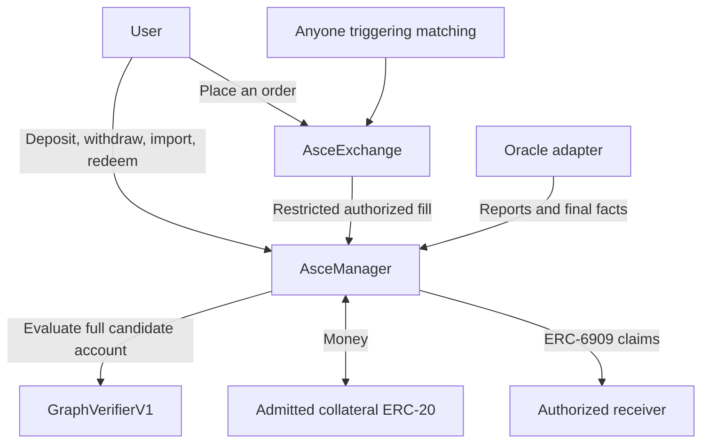
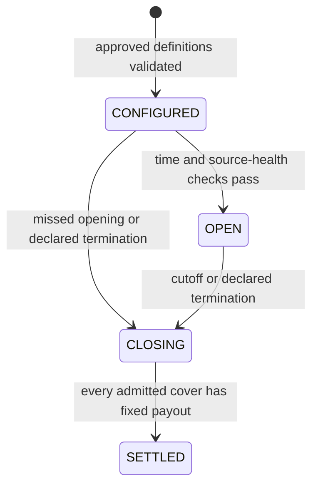
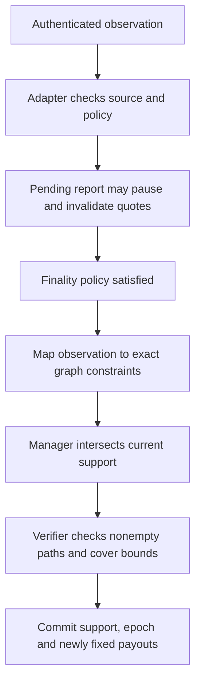

# AsceManager — components, state and execution guide

> Research architecture, not the current hackathon implementation target. Follow [the main MVP contract reference](README.md) for the chosen CTF implementation.

Status: implementation design and explanatory pseudocode. No Solidity contracts are implemented by this document. The [v2 kernel specification](../v2-kernel-spec.md) remains the mathematical authority. Read the companion [graph guide](graph-verifier-design.md) for payout definitions, graph evaluation and cross-cover netting.

The starting product uses **platform-approved event and cover definitions**. Any user can buy, resell or write units of admitted covers, subject to the same funding rules. Platform approval does not bypass verification or give market makers special collateral treatment. Permissionless parameterized templates are a later admission-policy extension.

## 1. The manager's job

AsceManager is the settlement and collateral contract. It answers four questions:

1. What does this cover promise to pay?
2. Who owns the claim and who owes the obligation?
3. Does every affected account remain fully backed?
4. How much collateral can be transferred or withdrawn now?

It does not discover prices or find counterparties. Those jobs belong to AsceExchange. It does not decide real-world truth; its oracle adapter supplies authenticated facts under the event's fixed policy.

| Component | Responsibility |
|---|---|
| `AsceExchange` | Store authorized orders, select counterparties, enforce prices, receivers, quantities and cancellation |
| `AsceManager` | Hold collateral, implement ERC-6909 claims, keep accounts and settle permitted operations |
| `GraphVerifierV1` | Read-only exact account/payout evaluation using the graph supplied by the manager |
| `AttestedOracleAdapterV1` | Authenticate observations, apply the agreed finality policy and map facts to graph constraints |

There is one manager per deployment version, not one manager per event. Events and covers are records inside it. There is no event factory or token contract per cover. A graph is data, not an additional contract.



The source of account authority is separate from `msg.sender` at settlement. When an exchange calls the manager, the caller is the exchange, while the makers remain the authenticated order owners.

## 2. Contract and library layout

These names describe code organization. Libraries use internal calls and manager storage; they are not separately deployed economic systems. Splitting files does not automatically reduce compiled contract size.

```text
AsceManager.sol
    CoreTypes.sol
    CoreStorage.sol
    DefinitionLib.sol
    AuthorizationLib.sol
    AccountLib.sol
    ExecutionLib.sol
    ExchangeSettlementLib.sol
    ClaimLib.sol
    ResolutionLib.sol
    AssetLib.sol
    LimitLib.sol

GraphVerifierV1.sol → GraphMath.sol
AttestedOracleAdapterV1.sol
AsceExchange.sol → order, book, matching and Asce-policy modules
```

| Module | Owns which logic | Important restriction |
|---|---|---|
| `CoreTypes` | Definitions, enums, requests and result types | No state mutation |
| `CoreStorage` | Layout of manager-owned mappings and indexes | No independent public mutation API |
| `DefinitionLib` | Canonical IDs, initialization and cover admission | Existing payout promises cannot be overwritten |
| `AuthorizationLib` | Direct-owner actions, exact signatures, nonce/generation checks | Token approval is not authority to create debt |
| `AccountLib` | Complete holdings, materialization, revisions and indexes | Never load a caller-selected subset that can omit liabilities |
| `ExecutionLib` | Build candidate account/reserve changes, conserve entitlement and commit | All affected accounts must pass before the operation completes |
| `ExchangeSettlementLib` | Restricted OWNED and WRITE settlement paths | No arbitrary-call or arbitrary-account-delta gateway |
| `ClaimLib` | ERC-6909 balances/permissions, export/import/mint/burn/redemption | Mint and burn must include their economic accounting |
| `ResolutionLib` | Reports, support narrowing, fixed payouts and closure | Final support cannot widen |
| `AssetLib` | Admitted ERC-20 transfers and exact receipt checks | Unsupported transfer-tax/rebasing behavior is rejected |
| `LimitLib` | Arithmetic, holdings, graph, batch, exposure and work limits | Admission must reserve capacity for eventual resolution |

AsceManager has a transaction-level reentrancy guard. Compound operations call internal helpers rather than externally calling guarded functions on itself. No user-selected `delegatecall`, payout callback or unrestricted “unlock now, repay later” path is part of this design.

## 3. State the manager maintains

### Deployment configuration

| State | Meaning |
|---|---|
| `verifier` | Immutable evaluator and version for this deployment |
| `oracleAdapter` | Immutable adapter allowed to apply reports/facts |
| `asceExchange` | Proposed immutable gateway allowed to submit bounded Asce fills |
| `deploymentVersion` | Identifies encoding and execution rules |
| `curator`, `globalGuardian` | Admission and exposure-control roles |
| Admitted asset/schema/creator rules | Gates for new events |
| Global exposure/deposit gates | Control new operations, not ownership of existing rights |
| `globalExecutionGeneration` | Invalidates old economic authorizations after relevant global gate changes |
| `accountedByAsset[asset]` | Total event escrow accounted for in this manager |

Bindings must be set safely at deployment, with no public uninitialized window. No proxy changing active payout promises is assumed. New engine versions use new deployments. Two chains have independent state and liquidity; the second chain is not yet specified.

### Event configuration: immutable after admission

```text
events[eventId].config:
    asset, asset precision
    graph / graph hash, verifier version
    source policy and observation mapping
    PROGRESSIVE or END finality
    opening and trading deadlines
    event admission authority and guardian
    exceptional-outcome and timeout rules
    arithmetic, graph, catalogue and exposure limits
```

An EventID commits to this configuration and graph under the deployment/chain domain. A human-readable event title is metadata; it is not enough to establish payout or netting relationships.

### Event runtime: changes during the event

```text
events[eventId].runtime:
    phase: CONFIGURED | OPEN | CLOSING | SETTLED
    exposurePaused, depositsPaused
    epoch
    supportVersion and current support masks
    escrow
    admitted cover IDs and resolved cover count
    exposure counters and finalized-fact replay tracking
```

`epoch` invalidates quotes after material event changes. `supportVersion` specifically tracks final narrowing of permitted histories. They are not interchangeable. A report can invalidate orders without changing funded histories.

### Cover definition and resolved payout

```text
covers[coverId]:
    exists
    eventId
    immutable canonical node/edge payout factors
    lot, dependency and resolution-rule commitments
    tradeUntil
    full-graph min/max and arithmetic/work bounds
    resolved: bool
    payoutPerLot: integer             // meaningful only if resolved
```

`coverId` commits to the complete payout definition and event. The ERC-6909 ID is `uint256(coverId)`. Zero payout is a valid final answer, so `resolved` must be separate from `payoutPerLot`.

External claim payout must be nonnegative on every permitted full-graph history. Signed intermediate factors are allowed if their total payout satisfies this rule. The Python kernel permits more general signed expressions; the token-facing restriction must be implemented explicitly.

### Internal account

```text
accounts[eventId][owner]:
    cash: signed integer
    quantity[coverId]: signed integer
    activeCoverIds[]
    indexPlusOne[coverId]
    revision
```

A positive quantity is an internal payment right. A negative quantity is an obligation. An external token balance is separate; it is not simultaneously an internal positive holding.

Cash is an accounting component, not the withdrawable wallet balance. It may be negative if internal rights guarantee sufficient future value. The account is safe only if its entire payout is nonnegative in every permitted history.

The active-cover list and index must remain consistent with quantities. Add a cover when quantity becomes nonzero; remove it when quantity returns to zero. The manager loads the entire active list when checking the account. No user-registration transaction is required for an empty account.

### External tokens, fees and replay

```text
ERC-6909:
    balances[owner][coverId]
    allowances[owner][spender][coverId]
    operators[owner][operator]
    totalSupply[coverId]

Core exact authorization:
    authorizationGeneration[eventId][owner]
    consumedNonce[eventId][owner][generation][nonce]

Fees:
    fixed policy / recipients
    cash-only internal fee entitlement per event
```

Exchange orders, filled quantities and book queues live in AsceExchange, not the manager. The exchange records the current global execution generation on direct placement and checks it at fill alongside event epoch. A future relayed payload must bind the corresponding generation; it cannot silently refresh an old quote after a global pause/resume.

Fee credits and ordinary account changes must be combined by unique account identity before checking and committing. A recipient alias must not overwrite another candidate update. The implementation must enforce its passive cash-only fee-account policy.

## 4. The accounting rules every operation preserves

For every account and every remaining permitted history:

```text
entitlement(history)
    = cash + sum(quantity[coverId] × payout(coverId, history))

minimum entitlement >= 0
```

For every event and every permitted history:

```text
sum(internal account entitlements)
  + sum(external totalSupply[coverId] × payout(coverId, history))
  = event escrow
```

The external-supply term is the **virtual reserve**: the payment rights held by external token owners. It is not additional money or an account that independently holds each cover's maximum collateral. `totalSupply` is its authoritative quantity; avoid a second mutable mapping that can drift.

```text
sum(holder balances for a cover) = its external totalSupply
accountedByAsset[asset] = sum(event escrows using that asset)
actual manager token balance >= accountedByAsset[asset]
```

These are global correctness statements checked through local conserving operations and reconciliation tests, not loops over every holder during a fill. Unsolicited token transfers are surplus, not automatic user deposits. Event-local bookkeeping is not physical vault isolation: a custody bug in the shared manager can affect multiple events.

## 5. Event and cover states



Phases do not move backward. Pause is a separate gate inside the lifecycle. Every financial call checks actual time; failing to call `beginClose` cannot extend a deadline.

Cover progression is `unknown → admitted/unresolved → resolved`. Trading eligibility may end before resolution. Resolution fixes a payout; it does not automatically transfer collateral or burn tokens.

| Operation | OPEN | CLOSING | SETTLED |
|---|---|---|---|
| Admit new covers / exchange fills | Only before deadlines and while healthy/unpaused | No | No |
| Deposit | If enabled | No | No |
| Withdraw verified free amount | Yes | Yes | Yes |
| Export/import unresolved rights | Subject to funding/limits | Subject to funding/limits | No unresolved covers remain |
| Ordinary external token transfer | Yes | Yes | Yes |
| Redeem a resolved token | Yes | Yes | Yes |
| Materialize internal fixed positions | Yes | Yes | Yes |
| Claim final account cash | No | No | Yes |

A new-exposure pause does not give an administrator ownership of collateral or discretionary power to rewrite redemption values. Admitted asset behavior and the fixed source policy remain material dependencies.

## 6. Admission and first use

The platform approves payout definitions, not each ordinary buyer or seller. Approval is followed by structural, arithmetic and budget validation.

```text
initializeEvent(config, graph, authority):
    authenticate permitted creator and configuration
    validate canonical encoding and derived EventID
    require EventID is not already initialized
    verifier.validateGraph(graph, limits)
    validate oracle/finality/exception policy binding
    store immutable config, full support and CONFIGURED phase
    initialize pinned adapter policy

admitCover(eventId, definition, authority):
    authenticate event admission authority
    require event OPEN, before deadlines and admission allowed
    validate canonical CoverID and dependencies on this event
    verify definition on the FULL graph, including exceptions
    require nonnegative total payout for transferable claims
    require current payout is still variable
    reserve work budget for future all-cover finalization
    store definition and append bounded catalogue entry
```

Optional standalone preparation calls and atomic first-use preparation can share these helpers. Computing an ID locally does not grant admission or minting authority. No approved definition can change the meaning of an existing cover.

## 7. Shared execution machinery

Convenience functions and exchange settlement should reuse one accounting pipeline. Pseudocode is conceptual; exact ABI/layout and Solidity storage optimizations remain implementation work.

```text
executeExact(operation, authorizations):      // nonReentrant
    check outer limits, domain, time and event gates
    prepare permitted first-use definitions if supplied
    authenticate every payer/debtor and value destination
    check epoch, global generation, revisions and unused nonces

    candidates = load COMPLETE affected accounts
    materialize fixed holdings into candidate cash
    apply all authorized cash/quantity/fee/claim deltas in memory
    combine aliases into one candidate per account
    check token balances, supply deltas and exact conservation
    check arithmetic, exposure and work limits
    require every candidate's graph minimum >= 0

    pull explicitly authorized external funding; verify exact receipt
    commit accounts, tokens, supply, replay and escrow state
    send authorized outgoing assets
    emit execution event
```

Any failure reverts the entire transaction, including transfers and replay consumption. A supplied `minimum` or partial list of liabilities is never trusted. Pulling before the final commit is safe only under the guard and full transaction rollback; arbitrary callbacks cannot execute against an intermediate financial state.

Direct actions authenticate the owner through that action's call. Exact relayed packages use domain-separated signatures and per-owner nonce/generation checks, including contract-wallet authorization. An ERC-20 approval alone does not authorize a package, and `tx.origin` is never an owner check.

## 8. Deposits and withdrawals

```text
deposit(eventId, amount):
    owner = msg.sender
    require deposits enabled, amount positive and limits satisfied
    candidate = materialize(loadAccount(owner, eventId))
    pull exact amount of event asset from owner
    candidate.cash += amount
    commit candidate with revision increment
    event.escrow += amount
    accountedByAsset[asset] += amount

withdraw(eventId, amount):
    owner = msg.sender
    candidate = materialize(loadAccount(owner, eventId))
    minimum = verifier.accountBounds(candidate, currentSupport).minimum
    require 0 < amount <= minimum
    candidate.cash -= amount
    commit account, increment revision
    reduce event escrow and asset accounting by amount
    transfer amount to owner
```

The manager checks current backing at execution, even if a preview was obtained earlier. Withdrawal is not `min(cash, amount)`; positive cash may all be needed for obligations, while a funded account can sometimes withdraw against a guaranteed internal right.

## 9. Exchange settlement: matching stays outside the manager

The exchange reads its best eligible orders, checks price crossing, selects bounded quantities and enforces maker-authorized terms. Its current design proposes best price followed by onchain FIFO and execution at the older order's limit. Book liveness with unfunded top orders remains unresolved; it is not part of the graph calculation.

```text
AsceExchange:
    authenticate stored orders and check remaining quantity
    check price bounds, fees, receiver and epoch/generation
    fill = construct narrow settlement request
    manager.settleAsceFill(fill)
    update filled quantities and cumulative fees
    // All changes and token movements revert together on failure.
```

The proposed gateway trusts the immutable exchange code for order authentication. That code is part of the security boundary: solvency does not prevent an unauthorized but fully funded trade. Pinning an address is not, by itself, proof of correct owner authorization. The deployed gateway must expose only the narrow behaviors below, not arbitrary withdrawals or account deltas.

```text
settleAsceFill(fill):                         // nonReentrant
    require msg.sender == pinnedAsceExchange
    context = stored cover → event → collateral
    check current epoch, phase, time, health and gates
    validate quantities, mode, recipients and fixed fee policy
    if OWNED: settleOwned(fill)
    if WRITE: settleWrite(fill)
```

Buyer collateral approval names AsceManager as ERC-20 spender. For owned cover movement, the manager's internal transfer helper checks and consumes the seller's ERC-6909 permission to the pinned exchange. Neither spender identity is caller-selectable. Ordinary standard `transferFrom` still checks its actual caller under normal ERC-6909 semantics.

### Existing-token sale

```text
settleOwned(fill):
    require seller owns quantity and exchange has claim-transfer permission
    pull buyer payment + buyerFee exactly
    transfer existing claims: seller → buy.receiver
    send payment - sellerFee to sell.receiver
    credit retained buyerFee + sellerFee to fixed internal fee account
    increase event escrow / asset accounting by retained fees only
```

No original writer obligation or external token supply changes. No graph margin calculation is needed simply to transfer existing external claims. Any other margin-account effects must still use the accounting pipeline.

### Writing new units

```text
settleWrite(fill):
    require sell.receiver == sell.maker
    candidate = materialize(loadCompleteWriterAccount(eventId, sell.maker))
    candidate.cash += payment - sellerFee
    candidate.quantity[coverId] -= quantity
    check candidate minimum >= 0 using current graph support
    check reserve conservation, exposure and all limits

    pull buyer payment + buyerFee exactly
    commit writer account and fee cash credit
    mint quantity claims to buy.receiver; totalSupply increases
    event escrow and accounted asset total += payment + buyerFee
```

The buyer receives tokens, not duplicate internal holdings. The premium enters writer margin; it is not simultaneously paid to the writer's wallet. Standing orders draw on deposited writer margin, not an unspecified wallet funding allowance.

Example without fees: six claims with maximum payout 100, sold at 30. Writer deposits 420; buyer pays 180. Writer cash becomes 600 and quantity −6. External supply becomes six. Worst writer entitlement is `600 - 6 × 100 = 0`; event escrow is 600.

A trade can create more units under the same ID. There is no predetermined supply allocation, but issuance remains bounded by funding, arithmetic and configured exposure limits.

## 10. Export, transfer, import and buyback

| Action | Internal quantity | External supply | Event escrow |
|---|---:|---:|---:|
| Export n internal units | −n | +n | Unchanged |
| Transfer external tokens | Unchanged | Unchanged | Unchanged |
| Import n unresolved tokens | +n | −n | Unchanged |
| Redeem n fixed tokens | No new holding | −n | Decreases by payout |
| Redeem fixed tokens to margin | Cash increases | −n | Unchanged |

```text
exportCover(coverId, n, receiver):
    authenticate internal owner and receiver
    require cover unresolved and internal quantity >= n
    candidate.quantity[coverId] -= n
    require complete candidate remains funded
    commit candidate and mint n external tokens to receiver

importCover(coverId, n):
    authenticate token owner; require cover unresolved
    require owner has n external tokens
    candidate.quantity[coverId] += n
    require complete candidate passes funding and limits
    burn n tokens and commit candidate atomically
```

Export can remove a hedge, so rechecking the residual account is essential. Token transfers after export do not remove additional internal backing. Token allowance does not automatically authorize importing into someone else's account or creating obligations.

A writer with quantity −6 can buy two external units and import them, changing quantity to −4. The manager then computes available withdrawal from the whole account. Buying back does not trigger a universal fixed collateral refund or merge two unrelated cover IDs.

## 11. Oracle reports, final facts and resolution



A pending report does not release collateral through provisional support narrowing. Final facts can only remove histories, never restore them. An empty intersection rejects the operation rather than making every account infinitely withdrawable.

```text
applyFinalFact(eventId, factId, constraints):
    require caller == oracleAdapter; reject replay
    require PROGRESSIVE mode and appropriate event phase
    candidateSupport = currentSupport INTERSECT constraints
    verifier.validateSupport(candidateSupport) // at least one complete path
    for cover in bounded admitted catalogue:
        low, high = verifier.coverBounds(cover, candidateSupport)
        if low == high:
            record cover fixed at low; never change an earlier fixed payout
    commit support, resolved records, factId, supportVersion++ and epoch++
```

This uses the current bounded eager catalogue scan. There is no implemented paginated finalization or million-cover catalogue. Admission must ensure the worst finalization fits its work budget. No holder scan is required.

END-finality events use the permitted final closing operation instead of progressive support release. `finalizeEvent` additionally checks closure eligibility and that every admitted cover is fixed before committing SETTLED. If manager application fails, adapter finalization must roll back too.

## 12. Materialization and redemption

```text
materialize(candidateAccount):
    for coverId in complete active holdings:
        if covers[coverId].resolved:
            candidate.cash += quantity * payoutPerLot
            remove that holding and its active-list index
    return candidate

redeem(coverId, n, receiver):
    authenticate owner and exact receiver
    require cover resolved and owner holds n tokens
    payout = checked(n * fixedPayoutPerLot)
    burn n tokens
    decrease event escrow and asset accounting by payout
    transfer payout to receiver

redeemToMargin(coverId, n):
    authenticate token owner; require fixed payout
    candidate = materialize(owner account in same event)
    candidate.cash += checked(n * fixedPayoutPerLot)
    burn n tokens; commit account and increment revision
    // Escrow is unchanged: an external right became internal cash.
```

Materialization is a representation change, not a new reward. A negative quantity subtracts the settled obligation from writer cash. Repeating it cannot credit the same holding twice because the holding is removed on commit.

With six claims, writer cash 600 and quantity −6, a fixed payout of 60 gives holders 360 and leaves writer entitlement 240. Holder redemption and writer withdrawal can occur in either order while preserving reserves.

`claimAccount` in SETTLED materializes, pays remaining account cash and debits it. Do not use a permanent “already claimed” flag: a later legitimate `redeemToMargin` may credit the same account again. Burned tokens and debited cash prevent duplicate payment.

## 13. Reads, logs and acceptance checks

Useful read calls include event context/epoch, cover terms and fixed payout, account cash/holdings/revision, token balance/supply, and account minimum/maximum. A preview is not a reservation or executable guarantee.

Emit definition, funding, execution, token, fact, resolution and withdrawal events with account/event/cover identifiers and exact amounts. Standard ERC-6909 logs describe token movement. Minting/exporting is not itself exchange trading volume.

Before deployment, verify:

- Complete-account conservation, including negative cash and every exceptional history.
- Owner/receiver authentication and the exact exchange permission boundary.
- No internal/external double entitlement; supply equals holder balances.
- Hedge export rejection, short closure by import and payout burn accounting.
- Partial fills, fees, callback reentrancy and atomic rollback across both contracts.
- Stale epochs/global generations and real signature replay protection.
- Oracle contradictions, empty support, end/progressive finality and late margin credits.
- Measured bytecode size and worst-case trade/admission/finalization gas.

The [netting review](../research/netting-safety-review.md) records 63 passing Python tests and synthetic accounting evidence. Those checks do not cover actual ERC-6909 custody, real signatures, the exchange gateway or EVM gas. The current Python per-account default is 64 holdings; that is a research guardrail, not a promised production capacity.
