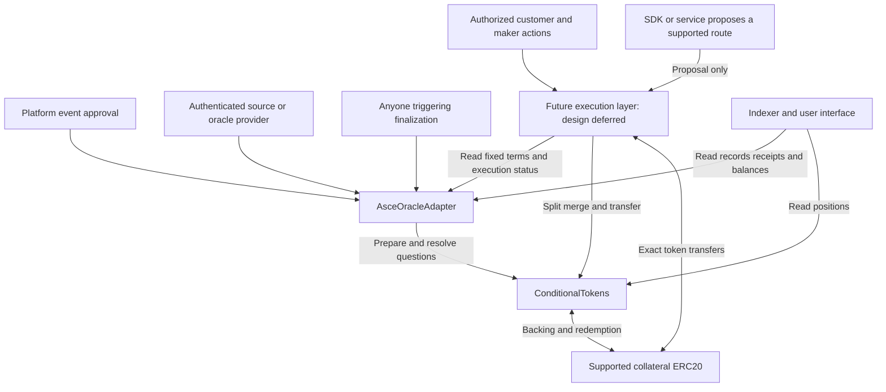

# AsceMarket CTF cover contract architecture

> **Main architecture reference for the first AsceMarket MVP.** Settlement and native claim construction are the current implementation focus. Exchange architecture is deferred; neither an onchain order book nor offchain signed orders are selected by this document. The earlier narrowed `contracts/README.md` proposal does not override this architecture.

Status: proposed implementation design, 30 September 2026. This is a separate CTF architecture, not an implemented migration or an assertion that the existing kernel contracts already follow it. The current Solidity files under `research/ctf` are test fixtures, not production contracts.

## 1. Decision and product requirements

Build a marketplace for transferable covers on future states of an approved event. An event identifies a subject and its observation rules. It does not necessarily have an expiry: ETH price is an ongoing event; a particular football match is a finite event. Each traded cover refers to a finite observation or checkpoint and has explicit trading and resolution boundaries.

Use native CTF positions for the initial cover family. Put the event registry, observation commitments and settlement-question records inside one shared `AsceOracleAdapter`. Build and test condition preparation, issuance, conversion identities, resolution and redemption independently of an exchange. A later execution layer supplies authorized assets and counterparties. Its matching model, order storage, signature scheme, fee policy and whether conversion execution shares its contract are deliberately undecided.

The intended product demonstration remains **buy a cover using related liquidity, widen/change it, then close or redeem it**. Settlement work can proceed now; a complete trading demo will later require an executable quote/authorization path. Deferring that choice does not mean CTF itself provides liquidity or matching.

The initial policy is **platform-approved events**, as clarified by the product owner. Users can define compatible covers without individual platform approval or an onchain cover-registration transaction. New settlement questions can be prepared publicly within an event's approved templates and parameter bounds.

The requirements are:

- An ongoing event can contain many independent future observation times.
- A cover binds to a precise observation, payout and exceptional treatment.
- The same cover has the same asset identity for every creator and owner.
- The common adapter establishes final facts and resolves the corresponding questions.
- Every issued token is backed; a route either completes in full or reverts.
- Compatible covers can reuse liquidity through actual CTF splits and merges.
- Settlement does not iterate over every cover, holder or question in an event.
- Event approval, metadata, oracle truth, trading authority and collateral custody remain distinct responsibilities.

This design does not adopt the old AsceManager account ledger, ERC-6909 token IDs or graph margin calculation. Those remain a separate architecture option. The [existing manager design](ascemanager-design.md) supplies useful authorization and immutability principles but has different storage and funding semantics.

## 2. Event, observation, question and cover

These four objects must remain separate:

| Object | Meaning | Example |
| --- | --- | --- |
| Event | Approved subject, source binding and observation policies | ETH/USD from a specified source |
| Observation | One precisely defined measurement under that event | Price selected under the approved rule for time T |
| Settlement question | The finite result domain and payout interpretation supplied to CTF | Which price bucket contains the observation at T? |
| Cover | A position paying for selected outcomes of that question | Price below 2,000, represented by a subset of buckets |

For a football event, observations can be halftime and final score. The match may have an expected end time, but the halftime question resolves independently of the final-score question. For ETH, the event remains open while each daily observation question resolves once.

An event's optional natural end is metadata only unless explicitly included as an enforceable scheduling constraint. Encode absence as a defined flag or zero timestamp, not an imaginary infinity value. Disabling creation of new questions never cancels existing positions.

The cover's observation is an economic term. Its order expiry is a trading instruction. Its claim remains redeemable after its trading deadline. The eventual oracle transaction can happen later than the observation itself.

## 3. What no cover registration actually means

There is no `covers[tokenId]` definition mapping, cover administrator or list of admitted covers. For native subset covers, the descriptor is the question plus collateral asset and outcome mask. The adapter resolves the question; all its subset positions acquire their payout simultaneously, without individual cover callbacks.

There is still finite-question initialization in CTF. A question must have a prepared condition before positions can be split. Preparing one shared categorical question can support many subset covers; it is not one initialization per cover. The [CTF contract](https://github.com/gnosis/conditional-tokens-contracts/blob/master/contracts/ConditionalTokens.sol) maintains condition outcome slots and final payout state.

CTF identity is derived as follows:

```text
questionId   = hash(canonical Asce settlement question)
conditionId  = CTF.getConditionId(AsceOracleAdapter, questionId, slotCount)
collectionId = CTF.getCollectionId(0, conditionId, indexSet)
tokenId      = CTF.getPositionId(collateralAsset, collectionId)
```

The last identity is CTF's ERC-1155 position ID. The collection uses CTF's helper algorithm; it is not a replacement application hash. See the [published CTF helpers](https://github.com/gnosis/conditional-tokens-contracts/blob/master/contracts/CTHelpers.sol).

Thus `tokenId(event + cover + observation + settlement)` is a useful conceptual description, but not the literal native formula. Terms reach the token identity through the canonical question and outcome mask. A user-selected arbitrary hash cannot be minted as a native CTF position ID.

A hash commits to terms; it cannot reveal those terms. Calls that need semantics receive the canonical descriptor as calldata, recompute its identifiers, and compare them with the authorized position identity and adapter records. The oracle does not decode a hash or rely on a backend to interpret an ambiguous title.

Asset identity is `(chainId, CTF address, tokenId)`. The collateral asset is included by the CTF position derivation. Price, owner, creator name, premium history, order nonce and requested coverage size do not alter the token ID. Native quantity is stake in collateral base units; a cover paying up to 100 is a quantity of the normalized claim, not a different instrument from the same claim sized at 50.

## 4. Two CTF representations and their consequences

### Shared categorical question

One question fixes a finite partition of the observation domain. Users select subsets. A threshold and an interval are native positions under that one condition. This is the recommended first execution profile because it preserves the conversions demonstrated in our [CTF evidence](../research/cover-marketplace-test-findings.md).

For numeric observations, use sorted bucket boundaries, explicit inclusive/exclusive conventions, unbounded outer buckets, and one INVALID slot. A threshold aligned with a boundary is exact for the specified observation. A threshold inside an existing bucket cannot be represented exactly by selecting that bucket. CTF allows at most 256 slots, including exceptional slots. Its native collections represent subsets of those slots. [Gnosis developer guide](https://conditional-tokens.readthedocs.io/en/latest/developer-guide.html)

The domain is immutable once the question is prepared. Adding a bucket later changes the question and condition. Do not present different grids as one freely convertible pool. Event approval should establish preferred domain templates so makers can concentrate liquidity.

### Independent predicate question

A cover such as `price < arbitrary K at T` can instead initialize its own YES, NO and INVALID question. Its question ID includes the predicate parameters. This supports custom thresholds without changing an existing grid, and the same final observation can resolve several such questions.

However, their CTF conditions and collateral pools are separate. Sharing an event, adapter or observation does not make their tokens natively convertible. The identity `interval = lower threshold - upper threshold` is not enough to convert tokens from unrelated conditions. Exact cross-condition conversion would need an additional funded mechanism and separate proof.

The interface must distinguish these modes. V1 uses shared questions for native routing. Independent predicate questions are an optional later extension with separate liquidity, not a hidden substitution for an unsupported requested cover.

General ramps and variable payout tables on a categorical domain can be represented by baskets of outcome claims. A single token wrapping such a basket would require additional custody/redemption logic, which is outside V1. This is not a claim that every scalar claim requires a wrapper: CTF also supports a dedicated scalar condition using fractional payout vectors. That condition does not automatically share native conversion liquidity with an unrelated categorical condition. The initial shared-domain subset profile needs no wrapper.

## 5. Contract layout and trust boundaries



| Component | Owns | Does not own |
| --- | --- | --- |
| ConditionalTokens | Backing, position balances, native issuance/conversion and redemption | Event meaning, order books, historical data selection |
| AsceOracleAdapter | Approved events, immutable question bindings, final observations, authorized reporting to CTF | User collateral, cover balances, trade price discovery |
| Future execution layer — deferred | User authorization, counterparties and atomic execution; order/matching storage chosen later | Real-world truth, arbitrary debt creation, mutable payout definitions |
| Offchain services | Metadata, descriptors, quote dissemination, route search and previews | Authority to change an authorized trade or determine final payouts |

The settlement deployment requires native CTF and one shared AsceOracleAdapter, plus the supported collateral token. The adapter must not pin an exchange address or require an exchange to prepare eligible questions, finalize facts or resolve payouts. Future exchanges read its question bindings and execution-status views. Custody approval is granted by asset owners to their chosen execution contract; the adapter does not grant it on their behalf.

Source verification can use an immutable provider-specific module. This is an integration boundary, not a separate event registry or per-cover deployment. All CTF questions use the common Asce adapter address as their oracle. A shared address does not mean every event uses the same upstream data provider.

## 6. Canonical definitions

The following shapes are implementation requirements, not final Solidity ABIs:

```text
EventSpec:
    schemaVersion
    subjectKey
    sourcePolicyId and canonical source parameters
    observationTemplateId and version
    allowed schedules, query parameters and domain templates
    unit, precision and normalization rules
    finality, timeout and INVALID policies
    optional natural event end and enforceable schedule bounds

ObservationSpec:
    templateId
    point time or checkpoint key or supported finite window
    canonical sampling/query parameters

QuestionSpec:
    eventId
    ObservationSpec
    payout interpretation version
    domain template and parameters

NativeCoverDescriptor:
    QuestionSpec
    collateralAsset
    indexSet
```

For V1, supported observations are a numeric point observation and an approved categorical/checkpoint observation. A window minimum, TWAP, cumulative total or barrier requires a separately specified source-verification template. An ordinary spot feed does not prove whether a price crossed a threshold earlier.

Derive `tradeUntil` and `finalizeBy` deterministically from the event's observation policy and selected observation. If user-custom deadlines become supported, they must enter the committed specification. An earlier trading cutoff selected only for one order belongs in that order. A special cover-wide transfer or trading restriction would require an additional representation; native CTF does not enforce it.

Use versioned, type-tagged `abi.encode` commitments for Asce definitions, with chain ID, adapter address and pinned CTF address in the deployment domain. Hash variable-length canonical parameters explicitly. CTF's own identifier helpers retain their native encoding.

```text
eventId       = hash(ASCE_EVENT_V1, deploymentDomain, canonical EventSpec)
observationId = hash(ASCE_OBSERVATION_V1, eventId, canonical ObservationSpec,
                     effective observation and finality policy)
questionId    = hash(ASCE_QUESTION_V1, observationId, payout interpretation,
                     canonical domain, effective trading and settlement terms)
```

A caller's account is not part of these semantic IDs. A cosmetic name or content URI is not part of them either. Two creators specifying identical terms get the same identifiers. Different source selection, time, precision, finality or exceptional treatment must produce a different economic identity.

The Polymarket inspiration is the lifecycle separation: initialize a question through an adapter, prepare its condition, obtain an oracle result, and report payouts. Its [published UMA adapter](https://github.com/Polymarket/uma-ctf-adapter/blob/main/src/UmaCtfAdapter.sol) stores question parameters; it is not evidence that a bare token ID supplies settlement semantics. Asce should preserve lifecycle discipline while using its own canonical event and observation model.

## 7. Minimal persistent state

Keep event records inside the adapter:

```text
events[eventId]:
    exists                       // permanent historical approval record
    newQuestionsEnabled
    tradingEnabled
    quoteEpoch

questions[questionId]:
    exists
    eventId
    observationId
    outcomeSlotCount
    tradeUntil
    finalizeBy
    executionEnabled
    quoteEpoch

observations[observationId]:
    final                        // independent of value/hash being zero
    canonicalResultHash
    finalizedAt
```

Event IDs already commit to the full event specification. Store no redundant configuration hash if that commitment can be verified from the supplied preimage. Question records cache the bounded fields needed for trading status and settlement binding. `canonicalResultHash` commits to either a valid observation or an INVALID result, including its source reference and reason under the policy.

CTF is authoritative for final question payout vectors and its payout denominator. Derive resolved status from that state instead of maintaining an independently mutable second payout table. Source-provider request or dispute identifiers are stored only when the chosen oracle integration needs them.

The cached question fields are a deliberate first implementation choice, not a mathematical minimum. They can later be recomputed from a validated descriptor to reduce writes, provided initialization, execution controls and settlement bindings remain equally verifiable. Optimize this only after measuring the cost of calldata validation versus storage access.

Exchange storage is out of scope for this settlement design. Fill tracking and cancellation will be required by the chosen order mechanism, but an order hash, maker counter, onchain queue or offchain dissemination model is not selected here. The adapter needs no order records, holder lists, infinite observation history or event-wide question/cover arrays for correctness.

Emit full bounded canonical definitions in `EventApproved` and `QuestionPrepared` receipts. Indexers retain them, and traders receive them with orders and downloadable position receipts. Resolution accepts these preimages as calldata. Hash-only storage saves gas but introduces data-availability work: redundant descriptor archives are required. If that operational guarantee is insufficient, store the bounded definitions onchain rather than pretending hashes recover lost data.

## 8. Approval and condition preparation

`approveEvent(EventSpec)` is platform-authorized. It validates source/template support, precision, schedule limits and domain policy; derives the ID; records immutable approval; and emits the specification. Altering economic terms creates a new event ID. Existing terms cannot be overwritten.

`prepareQuestion(EventSpec, QuestionSpec)` is public within an approved event:

1. Verify the event preimage and permanent approval record.
2. Validate observation parameters and domain against its fixed rules.
3. Derive deadlines, observation ID, question ID and slot count.
4. If already recorded, verify the same binding and return its condition ID.
5. Otherwise require new questions enabled and creation before the trading cutoff.
6. Prepare the CTF condition with the common adapter as oracle, or adopt an already prepared identical condition after checking its slot count and unresolved state.
7. Store the minimal question record and emit its full canonical preimage.

CTF preparation is public, so another caller can prepare the identical condition first. That must not permanently block the adapter through a duplicate-preparation revert. An externally prepared condition without the adapter's question record is not an approved Asce trading instrument. Clients and the exchange must check the adapter record.

The first trade can combine preparation and execution in one transaction. Existing questions require no new preparation. Choosing another native outcome mask requires no cover-admission operation.

Native CTF also permits direct calls outside Asce. App approval rules are enforced by Asce's adapter and exchange, not retroactively by the external CTF contract. Do not claim that an Asce pause can stop all external transfers or issuance of existing native CTF positions.

## 9. Observation finality and settlement

Latest oracle state is useful for display and quoting; historical final facts determine payout. Each observation ID has one immutable finalized result. The adapter verifies the event's approved source, query, timestamp/checkpoint, normalization, finality and proof before committing it.

The adapter need not copy every ETH price update onchain. Display services can read current source data; settlement commits only the finite observations used by questions. Questions for earlier dates retain their own final commitments when the provider publishes a new price. A deployment-wide pointer to the latest value is insufficient settlement state.

A numeric observation template must specify how data at T is selected. For example, if it means the first qualifying report at or after T, verification must establish that selection and a maximum permitted delay. Accepting any report in a broad time window lets a resolver choose a favorable result. The concrete provider integration must establish historical selection; it remains a required implementation decision.

`finalizeObservation(EventSpec, ObservationSpec, result, proof)` is publicly triggerable but source-authenticated. Permissionless callers cannot choose the answer. The verification module and policy version are pinned by the approved event. A result is accepted only after its contractual finality procedure and no later than its defined finalization deadline.

`timeoutObservation(...)` is public after that deadline if no result is final. It commits the predetermined INVALID treatment. Valid finalization is allowed through the deadline; timeout is allowed strictly after it. Existing final facts cannot be overwritten by a timeout or late correction. The economic policy for a delayed dispute must be agreed before trading, not decided by an administrator later.

`resolveQuestion(EventSpec, QuestionSpec, finalizedResult)`:

1. Recompute and validate the registered question and observation bindings.
2. Verify the supplied result against the adapter's final observation commitment.
3. Reject an already resolved condition or an incompatible observation.
4. Compute the payout vector deterministically from the immutable domain.
5. Call `CTF.reportPayouts(questionId, payouts)` from the adapter.

Anyone can trigger this process. It resolves one finite question in bounded work. Keepers may batch a limited number, but there is no call that must resolve all ETH covers. An observation can be reused by multiple questions; each question still needs its own CTF payout report.

Adapter state-changing entry points must also reject reentrancy. Source verification uses a pinned read-only verifier or an authenticated provider callback, never a user-selected contract. Final result commitment and payout reporting are atomic where combined; failures cannot leave an adapter claiming a payout was reported when CTF rejected it.

A user redeems through CTF after resolution, without an Asce holder registry. Disabling new trades must not disable redemption or change recorded truth. New source observations, future questions and later match checkpoints do not reopen earlier payouts.

## 10. Cancellation and invalid data

The initial shared-domain profile has explicit normal outcomes plus one INVALID slot. Normal coverage masks exclude INVALID and therefore pay zero in that result. The residual INVALID claim remains with an explicitly identified holder; the interface must show this allocation.

This is an initial settlement profile, not an assertion that zero cancellation payouts are commercially preferable. Domain approval must assess those terms for the chosen product. If different cancellation economics are required, choose an explicit funded representation before opening the question.

Do not call a CTF complement a normal-only NO cover without checking its INVALID bit. A full complement of YES includes INVALID; a normal-only opposite excludes it. They are different positions and can have different prices.

Historical premium refunds are not properties of a fungible native position: buyers may have paid different prices and resold it. Fixed cancellation amounts can be represented by weighted baskets or a separately designed wrapper. Neither a void button nor a registry flag can manufacture those funds.

## 11. Deferred exchange and stable settlement integration

The exchange is a later design decision. Do not implement or assume a signed offchain order book, persistent onchain book, FIFO matcher, generic token exchange, fixed fee model or quote-reservation system as a consequence of this document.

### What can be built now

- Canonical definitions and native CTF identity helpers.
- Platform-approved events and public bounded question preparation.
- Source-authenticated final observations, timeout behavior and deterministic CTF payout reporting.
- Native full splits, compatible partial splits/merges, transfers and redemption.
- Independent tests proving the assets consumed and delivered by buy/change/close constructions.

A conversion is an asset transformation, not a matching algorithm. A route test may supply explicit counterparties and balances through a research fixture without selecting the production exchange architecture.

### Adapter reads for any future exchange

Expose bounded, exchange-independent reads or descriptor-validation helpers for:

```text
getQuestion(questionId)
    → eventId, observationId, conditionId, slotCount, tradeUntil, finalizeBy

getExecutionStatus(questionId)
    → enabled, eventQuoteEpoch, questionQuoteEpoch,
      observationFinal, conditionResolved

validateDescriptor(EventSpec, QuestionSpec, collateralAsset, indexSet)
    → verified question/condition/position identity and applicable policy
```

These are conceptual interfaces, not finalized ABI signatures. The future executor must check a registered compatible question, permitted collateral, current gates/epochs, time before tradeUntil, and an observation and CTF condition that are not final. A delayed CTF payout-report transaction must not leave a known outcome tradable.

### Requirements that apply whichever exchange is chosen

Maker, receiver and transaction caller are separate roles. Each participant authorizes its actual assets, amounts, destinations, price/fee bounds and validity period. Direct calls, onchain standing orders or domain-separated signatures can provide that authority; the chosen mechanism needs its own precise replay, cancellation and partial-fill semantics. Token approval alone is insufficient.

The executor must validate actual customer inputs/outputs and bounded net debit or credit. All conversion legs, payments and any fill counters succeed atomically or revert together. Plans cannot contain arbitrary target calls, user-selected delegatecalls or a general payout interpreter.

For the initial native conversion profile, collateral, parent collection, condition and masks must be compatible. Use parent collection zero and one condition per conversion route. Direct trades of positions from other questions do not imply cross-question offsets.

An inventory SELL authorizes existing tokens, not an uncovered short. Buyer-funded issuance is a different construction: explicitly authorized contributions fund a full disjoint partition, with every residual claim allocated. It remains a valid architecture capability; its production integration and implementation order are decided with the execution layer. Neither inventory-only trading nor buyer-funded issuance is silently mandated as the sole path.

Research evidence does not establish fee rates, firm reservations or automatic liquidity. If quotes are unreserved, competing fills may consume their inventory or cash and cause execution to revert. User-facing guarantees must match the later chosen mechanism.

## 12. Worked native routing example

At one fixed observation, use values 0 through 7 plus INVALID, giving full mask 511:

| Cover | Normal outcomes | Mask |
| --- | --- | ---: |
| T2 | 2 through 7 | 252 |
| T5 | 5 through 7 | 224 |
| C | 2 through 4 | 28 |

T2's mask is the disjoint union of C and T5. A maker asks 40 for 100 units of T2; another bids 15 for 100 units of T5. The customer pays 25 before fees.

The route receives T2, performs the partial split `[28,224]`, delivers C to the customer and T5 to its bidder, and transfers the agreed cash. This burns an existing position and creates its components; it does not require a new full collateral deposit. All parties must authorize their actual economic contribution and receipt through the later chosen execution mechanism.

Neither a threshold at another observation time nor a threshold from an independently initialized condition is interchangeable with this T5. The new cover's name is irrelevant to its identity; the common question and mask are essential.

## 13. Asset custody and execution invariants

Use supported conventional ERC-20 collateral assets with known precision and exact transfer behavior. Reject fee-on-transfer or rebasing assets in V1. CTF holds issuance backing. The exchange holds only transaction-scoped assets used for execution; it has no reusable customer margin account.

Enforce these invariants:

1. Every traded ID is derived from the supplied canonical descriptor and the pinned CTF instance.
2. Every question resolves from its pinned event policy and matching final observation.
3. Every issuance consumes the necessary CTF backing; merges consume every required position.
4. Each trade's fill quantity, cash movement, receiver and fees remain within its owner's authorization.
5. The customer's actual incoming/outgoing assets meet the authorized limits after fees.
6. A route cannot consume balances or allowances belonging to unrelated participants.
7. Execution never depends on prior donations or residual balances held by the router.
8. All failures leave economic state and order counters unchanged.
9. Final observations and payout commitments are irreversible under the deployed rules.

Use balance snapshots and checked transaction deltas, not the router's aggregate balance as available funding. Constrain ERC-1155 receiver callbacks to the pinned CTF and the active expected operation. Account for every intermediate and residual position; send funded residuals to their authorized recipients. Plain transfers may still create unexpected balances, so surplus recovery must not be usable to appropriate assets from an active route.

Measure receipt amounts for ERC-20 transfers. Bound plan size, unique questions, fills, partitions and quantities. Pin contract bindings at deployment. There is no public initialization window, user-controlled approval target or economic upgrade of already traded definitions.

## 14. Operational controls and failure handling

The platform curator approves event definitions. A guardian may stop new questions or Asce execution and increment quote epochs. Neither role may replace a final observation, rewrite an existing payout policy, seize CTF backing, or block ordinary CTF redemption.

An epoch invalidates old economic orders; it does not change a condition ID or token's payout. Event-wide epochs can be conservative but expensive for an ongoing price event. Question epochs are available for targeted suspension. Source corrections are handled by the fixed finality policy, not by administrative reinterpretation.

Do not increment an event-wide epoch for every ordinary ETH price tick. Makers price normal movements and choose expiry/cancellation instructions. Execution cutoffs must precede when the chosen checkpoint or observation becomes knowable; a scheduled match time is not a reliable substitute for the actual checkpoint policy. Provisional source reports can suspend execution without finalizing a payout. The selected provider must specify how this signal reaches the adapter or guardian.

Oracle-source compromise remains a real trust risk. Sharing an adapter does not make a bad provider truthful. Provider proxies or governance changes may affect source reliability even if Asce's own code is immutable. Source integration and exposure monitoring must assess this explicitly.

Keepers need an operational incentive to publish results and resolve questions. V1 can use a platform-funded keeper service with public fallback calls. A bounty pool or provider dispute bond is separate from CTF collateral and needs explicit accounting if introduced. Minimal settlement storage does not imply zero operational settlement cost.

If an observation fails to arrive, the timeout policy supplies a terminal INVALID result. If the fixed verifier itself becomes unable to execute, there is no hidden admin truth override in this proposal. That risk must be addressed in the selected provider integration and deployment review; a recovery authority, if desired, is a material trust feature to specify before trading.

## 15. Implementation sequence and acceptance tests

### Current phase: settlement and conversion foundations

1. Canonical encoding library, native identity fixtures and shared adapter with approved event records.
2. Select one first observation family and concrete source/finality/timeout policy. Numeric point and match checkpoint are supported design categories, not a requirement to implement both for the first demo.
3. Public bounded question preparation and direct CTF resolution/redemption.
4. Native full-partition funding and single-condition split/merge tests, including residual and INVALID allocation.
5. Buy/change/close construction fixtures with explicit authorized test participants; verify every terminal outcome and failed operation.

### Later phase: choose and integrate execution

Select order placement/storage, matching, authorization, cancellation, partial-fill rules, fees and reservation policy. Then implement the smallest execution layer that demonstrates the intended cover journey. Keep that choice separate from event semantics and CTF custody. Add indexer/quote services and customer views around the actual chosen mechanism.

Required tests include:

- Identical definitions from different callers produce identical IDs; changed economic terms do not.
- An ongoing ETH event prepares multiple dates; resolving one leaves the others unchanged.
- Match halftime settles independently of final score.
- New native subset covers require no stored cover definition or cover-admission call.
- Preparation front-running cannot block an identical approved question.
- A forged descriptor, wrong event, wrong condition, wrong mask or collateral substitution fails.
- Provisional, wrongly selected, stale or unauthenticated observations cannot finalize a question.
- Valid finalization and timeout have unambiguous deadline behavior; replay and corrections cannot overwrite final facts.
- INVALID allocation, complements and zero payouts are tested explicitly.
- The later execution integration must preserve authorized limits across direct trades, partial fills, cancellation and epoch changes.
- A funded issuance cannot create debt from a SELL order or spend an unauthorized maker contribution.
- Every failed route reverts all legs and counters; donated router balances cannot subsidize it.
- All outcome redemptions reconcile to the actual backing; rounding cannot create claims.
- Reentrancy, receiver callbacks, unsupported assets and bounded execution limits are exercised.

The existing research demonstrates one finite native interval lifecycle and matching funding examples. It does not yet test this approved-event adapter, independent observations, production signatures or provider integration. These acceptance cases are implementation requirements, not completed checks.

## 16. Decisions before production implementation

The settled architecture direction is: platform-approved events; user-selected compatible covers; one shared exchange-independent adapter; native CTF IDs and custody; no native cover registry; finite questions underneath ongoing events; compatible split/merge constructions; separate funding across incompatible questions.

Exchange implementation is explicitly deferred. The onchain/offchain order model, matching algorithm, executor packaging, fees and reservation policy remain open. These choices do not block implementing the settlement foundation.

The following concrete choices still need implementation-specific evidence:

| Decision | Required evidence |
| --- | --- |
| First event family and data provider | Reliable historical query/checkpoint semantics and contractual finality |
| Preferred numeric domains | Customer threshold needs, achievable maker depth and boundary accuracy |
| Cancellation profile | Customer acceptance and a fully funded representation |
| Target chain, CTF deployment and collateral | Verified addresses, bytecode and compatible asset behavior |
| Settlement work limits | Gas measurements for preparation, proof validation, reporting and redemption |
| Later exchange and execution policy | Explicit decision on order storage, matching, authorization, partial fills, fees, reservations and bounded routes |
| Oracle and keeper economics | Data cost, resolution delay, monitoring and exposure-dependent security |

CTF's current code and Polymarket's adapter were inspected as primary-source references. Deployment addresses or audited bytecode are not selected by this document. The design should be validated on the actual chosen deployment before handling real funds.


## 17. Copy-ready handoff prompt for the next LLM

Copy the following into a new coding/review session. It describes the agreed context; the next user's specific task determines which work to perform.

```text
You are working on AsceMarket in this repository. Read
contracts/ctf-cover-architecture.md first: it is the main architecture reference.
Then read research/cover-marketplace-test-findings.md and inspect the relevant
research/ctf fixtures before relying on their results. Check applicable AGENTS.md.

PRODUCT
Build a small but substantive cover-marketplace MVP: users select reusable
covers on approved events, buy through compatible direct/related liquidity,
change their protection, then close or redeem. Do not replace this with a generic
YES/NO UI or customer-specific RFQ-only product. Do not promise liquidity just
because a payout identity exists.

AGREED ARCHITECTURE
- Native Gnosis CTF ERC-1155 positions and collateral custody.
- One shared AsceOracleAdapter for approved events, finite questions,
  immutable final observations and deterministic CTF payout reporting.
- Platform approves event/source/template rules. Users choose compatible covers
  within those rules without individual cover registration/approval.
- An ongoing event can contain many independent finite observations/questions.
- Native subset positions use CTF condition/collection/position helpers.
  Use a shared categorical question for the initial compatible routing family;
  arbitrary thresholds inside a bucket are not exact subset claims.
- Parent collection zero and one condition per initial conversion route.
- No wrappers, custom AsceManager signed-margin ledger, graph evaluator,
  per-event factory or protocol USDC token in the chosen MVP architecture.
- Old kernel/model_v2 work is comparison research, not a second custody engine.

EXCHANGE IS NOT DECIDED
Do not assume offchain signed orders OR an onchain persistent order book.
Do not choose matching priority, fees, reservations, signature structs or a
router/exchange contract split without an explicit next design task.
The prior narrowed contracts/README.md proposal was withdrawn; it does not
mandate onchain posted quotes, zero fees or inventory-only issuance.
Keep adapter preparation, resolution and redemption independent of any exchange
address. Conversion mechanics can be specified/tested before matching is chosen.
A complete trading demo will later need actual authorized executable quotes.

CURRENT WORK DIRECTION
Prioritize canonical definitions/IDs, approved event records, public idempotent
question preparation, precise observation selection/finality, timeout/INVALID,
CTF resolution/redemption, and tests for compatible funded split/merge routes.
Choose one first observation family; numeric ETH and football are examples,
not an instruction to implement every event type immediately.

NONNEGOTIABLE SEMANTICS
- Hashes commit to terms; they do not recover semantics from a title or ID.
- Every source, timestamp, precision, finality and exceptional rule is bound.
- Same approved question can support many subsets without storing every cover.
- Different times/conditions do not automatically share collateral or liquidity.
- CTF supports scalar payout vectors, but that does not make arbitrary scalar
  claims freely convertible with an unrelated categorical question.
- Initial normal masks exclude INVALID and pay zero there; explicitly track who
  owns INVALID. A complement including INVALID is not a normal-only opposite.
- No arbitrary payout correction after finality. Timeout is a predetermined rule.
- No minting without backing, hidden debt from a SELL, or unauthorized residual
  funding. All legs and counters of an execution must revert together on failure.
- Actual token balances/allowances and authorization are different checks.
- Do not claim native CTF transfers can be globally frozen by an Asce app pause.

EVIDENCE AND LIMITS
research/ctf Solidity helpers are research fixtures, not production code.
The recorded/reproduced local run has 160 assertions, 7 expected reverts and
26 terminal redemption scenarios. Do not say these test the proposed adapter,
real signatures, production oracle integration, live liquidity or profitability.
Do not call something verified unless you inspected or ran the relevant check.

OPEN CONFIGURATION
Provider and historical selection proof, first schedule/domain, concrete finality
and timeout timings, collateral and verified chain deployments, gas/work limits,
and eventual exchange policy remain to be selected. Monad is known from prior
context; the second chain is unspecified. Do not assume identical runtimes.

WORKING STYLE
Explain decisions in simple words with functions, flows, state changes and
pseudocode. Correct flawed assumptions rather than agreeing automatically.
Separate agreed requirements, recommendations and unimplemented features.
Keep architecture minimal. Read current files before editing; preserve unrelated
user changes. If asked for implementation, write and test the requested code,
not another architecture replacement. Do not deploy or change product scope
merely because a research fixture makes a mechanism possible.
```
