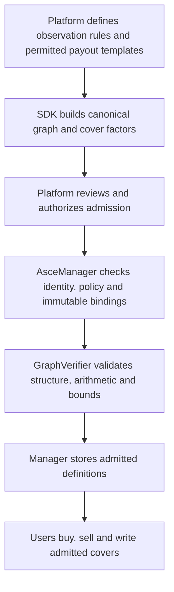

# The graph and verifier — payout definitions, netting and final facts

> Research architecture, not the current hackathon implementation target. Follow [the main MVP contract reference](README.md) for the chosen CTF implementation.

Status: design explanation of the current finite-graph kernel and its proposed contract port. Read [AsceManager](ascemanager-design.md) for custody, permissions and token operations. This guide does not claim support for arbitrary continuous formulas or unrestricted user programs.

## 1. What a graph means here

A graph describes **the histories that the contract promises to handle**. A cover describes a payment on those histories. The verifier combines all cover positions in an account and finds that account's smallest possible remaining value.

These are different things:

| Thing | Example | Where it belongs |
|---|---|---|
| Observation variable | ETH/USD at a specified time and source | Event definition |
| State | ETH price at a checkpoint, plus any required past information | Graph node |
| Transition | A permitted move from one checkpoint state to the next | Graph edge |
| Complete history | One permitted route from the first layer to the last | Graph path |
| Cover | Pay 100 if final price exceeds 2500, or a capped scalar payment | Validated payout factors on nodes/edges |
| Account | Cash and signed quantities of admitted covers | AsceManager storage |

A hundred covers do not require a hundred mutually exclusive outcomes. Many different covers can pay from the same observation. The graph expresses the common observation space; cover definitions express different functions on it.

The graph is not an order book, an oracle feed, a correlation estimate or an AI model. It does not guess relationships from names or historical prices.

## 2. Contract and compiler responsibilities



| Component | Responsibility | What it cannot establish alone |
|---|---|---|
| SDK/compiler | Translate supported product rules to canonical factors and graph data | A generated hash is not proof the economics are correct |
| Platform admission authority | Approve event semantics, source policy, templates and exceptional outcomes | Approval cannot bypass funding verification |
| AsceManager | Store definitions, load full accounts/current support and commit valid operations | It cannot infer arbitrary payout meaning from an ID |
| `GraphVerifierV1` | Validate supported representation and calculate exact extrema | It cannot discover real-world outcomes omitted from the definition |
| Oracle adapter | Authenticate observations and deterministically map them to graph constraints | An attestation alone does not prove real-world truth |

Initially, admission is platform controlled. Any user may transact in approved covers under equal rules. Later, a user could supply parameters to an approved template if onchain validation constructs and checks the same supported representation. Arbitrary text or arbitrary executable callbacks are not admitted payouts.

## 3. Define the observation before defining its covers

An “ETH September event” title is insufficient. The event definition must specify:

- Exactly which price/source and observation timestamp or checkpoints are used.
- Price denomination, precision and admissible domain.
- How observations map to integer states without undefined rounding.
- Whether finality is progressive or only at the event's end.
- How missing data, cancellation, delayed finalization and out-of-domain observations settle.
- What history must be retained to evaluate all supported covers.

Two covers referring to the same price at the same timestamp can share a variable. September 15 price and September 30 price are different variables. Two source prices are not automatically identical. “Ever touched 3000” cannot be determined from the closing price alone.

The event graph must include every jointly permitted history. When no relationship is guaranteed between two checkpoints, transitions must allow all combinations admitted by the contract. Empirical correlation does not justify deleting a dangerous transition to reduce collateral.

## 4. Graph storage

The baseline is a finite layered directed acyclic graph. Edges go between adjacent layers, so evaluation always terminates.

```text
GraphDefinition:
    encoding / language version
    layers[t]: state count and canonical indexing
    edges[t]: allowed (sourceIndex, destinationIndex) pairs
    observation and exception-policy commitments
    arithmetic and work limits

EventRuntime:
    supportMasks[t]: currently permitted state indices
    supportVersion
    epoch
```

Full support initially permits all admitted state indices. Impossible starts are excluded from the initial graph representation; they must not be left as freely selectable initial nodes. The model treats every included first-layer node as an allowed start. A unique start node is often convenient.

```text
Layer 0             Layer 1                Layer 2
start          →    price at t1       →    price at t2 / final state
                    failure state    →    absorbing failure state
```

Actual adjacency is defined explicitly. A failure state only transitions as the agreed failure rules allow; it is not a shortcut to an arbitrary payout. Early termination can be padded with absorbing states so every complete path ends in the terminal layer.

No graph mutation adds a new history to an active event. Final facts restrict current support within the immutable graph. New product semantics require a new event/version if they cannot preserve existing promises.

## 5. Cover payout representation

A cover stores sparse integer contributions:

```text
CoverDefinition:
    eventId
    nodes: (layer, state, amount)
    edges: (layer, source, destination, amount)
    lot / dependencies / resolution / exception terms
    trading deadline and language version

payout(cover, path)
    = sum(its node contributions visited by path)
    + sum(its edge contributions traversed by path)
```

An absent factor means zero. Each payment is assigned exactly once. Amounts use the settlement asset's integer base units per admitted claim lot. Cover quantity multiplies that per-lot payout.

Examples:

- Binary final-price cover: terminal node pays 100 where the threshold holds, zero elsewhere.
- Scalar final-price cover: terminal node contains the exact scalar payment for that represented price.
- Change between checkpoints: an edge can pay a function of its source and destination values.
- “Ever touched threshold”: states must retain whether the threshold has been touched; closing price alone is insufficient.

Factors may be signed, but a transferable claim's **total payout** must be nonnegative on every full-graph path. The manager enforces that token-product restriction at admission. Maximum payout and conservative absolute-factor bounds are also validated.

### History that is not local

If a payout depends on nonadjacent observations, there are two safe choices: encode the required memory into states, or reject the definition as unsupported. Hidden offchain memory or a caller-supplied “relationship” cannot make it valid.

```text
Insufficient state: closingPrice
Sufficient for a touch cover: (closingPrice, touchedThresholdEarlier)
```

The extra boolean can increase state count; many independent historical flags can cause exponential growth. The platform must choose supported templates that fit measured limits. Generic payout semantics do not mean every function is cheap to evaluate.

## 6. ETH example: scalar and binary covers together

Assume three covers depend on the same final ETH price P:

```text
A(P) = min(100, max(0, 2500 - P))
B(P) = 100 if P > 2500, otherwise 0
C(P) = 100 if P < 2600, otherwise 0
```

These numbers are human-readable example units. Production definitions must specify exact base-unit conversions and integer payout precision.

| P | A(P) | B(P) | C(P) | A+B | A+B+C |
|---|---:|---:|---:|---:|---:|
| 2300 | 100 | 0 | 100 | 100 | 200 |
| 2450 | 50 | 0 | 100 | 50 | 150 |
| 2500 | 0 | 0 | 100 | 0 | 100 |
| 2550 | 0 | 100 | 100 | 100 | 200 |
| 2700 | 0 | 100 | 0 | 100 | 100 |

The five rows illustrate the payout functions; they are **not** a sufficient production state space for arbitrary ETH prices. All promised prices and exceptional outcomes must be represented or handled by a proved equivalent evaluator.

Over the stated normal-price functions, A+B never exceeds 100 and A+B+C never exceeds 200. The full collateral requirement must also include exceptional branches. If a cancellation branch pays 100 on both A and B, the required A+B backing becomes 200.

A buyer holding A and B still owns two separate claims. Their token IDs are not merged. A writer owing both receives shared backing credit only because the combined payout has a lower maximum than the sum of individual maxima.

## 7. Exact scalar representation and its limits

The current verifier evaluates a **finite table of states and edges**. It does not perform general continuous optimization.

| Representation | Safe use |
|---|---|
| Constant-payout price regions | A region can be one state when all admitted cover payouts and relevant future behavior are preserved within that region |
| Exact finite price ticks | A scalar payout can be tabulated exactly over the specified finite domain, subject to state/work limits |
| Piecewise-linear analytic evaluator | Could evaluate extrema at suitable boundaries/breakpoints, but requires a separately specified and tested verifier capability |
| Sampled prices standing in for continuous prices | Not an exact proof; cannot silently replace the promised settlement rules |

A bucket labeled “below 2500” works for an appropriate binary condition. It is not sufficient for A's varying scalar payment. A new scalar cover cannot be admitted to an old coarse graph merely by paying an average value for that bucket.

If a definition requires more state detail than the immutable event graph contains, reject it for that event. Create an appropriate new event or separately verified engine version. Updating resolution later must never change already-issued cover promises.

The same restriction applies to combinations: a verifier that handles two cover families separately must also correctly evaluate their joint account before granting cross-family netting.

## 8. Verifier entry points

`GraphVerifierV1` holds no collateral, accounts, token balances or order book. The manager invokes a pinned read-only evaluator, validates its response and rejects any failure.

| Function | Inputs | Output and purpose |
|---|---|---|
| `validateGraph` | Canonical graph and limits | Valid structure, reachability and bounded work |
| `validateCover` | Full graph and one definition | Full min/max, factor bounds and complexity |
| `validateSupport` | Graph and candidate masks | At least one complete path exists |
| `accountBounds` | Graph, current support, full cash/holdings and referenced definitions | Exact minimum/maximum, optional witness and work count |
| `coverBounds` | Graph, current support and one cover | Detect whether its payout is now fixed |

These may share internal functions rather than duplicate algorithms. The manager supplies stored definitions and complete account state. A public client preview may evaluate arbitrary input, but its output cannot authorize a financial change.

## 9. Admission pseudocode

```text
validateGraph(graph, limits):
    require supported encoding and nonempty bounded layers
    require exactly one edge table per adjacent pair of layers
    require every edge endpoint is in range
    reject duplicate transitions and invalid indices
    prove at least one initial-to-terminal path exists
    check state, edge, layer and work limits
    return validated structural properties

validateCover(graph, cover, limits):
    require cover belongs to the exact event / graph context
    reject duplicate factor locations and invalid node indices
    reject factors on nonexistent edges
    require canonical sorted encoding and bounded factor count
    require each amount fits signed arithmetic limits
    result = bounds(fullSupport, cash=0, quantity=+1 for this cover)
    require result.minimum >= 0 for an external-token cover
    reserve arithmetic and resolution work capacity
    return result.minimum, result.maximum, factorAbsSum, complexity
```

Canonical node/edge serialization, domain-separated IDs and Solidity fixture parity are implementation tasks. The Python reference uses JSON/SHA-256 identities; copying those strings is not the proposed production ABI/Keccak encoding.

Structural checks prove properties of the supplied graph. They do not prove that an incorrect source policy or omitted real-world possibility matches a marketing description. Curated semantic review and independent template tests remain necessary.

## 10. Account compilation: how 100 covers become one calculation

The manager loads signed positions, for example:

```text
cash = 200
A quantity = -1
B quantity = -1
C quantity = -1
```

For each state or edge, sum the contributions of **all holdings in that account**:

```text
compileAccount(account, coverDefinitions):
    require active holdings count within limit
    U = zero node amounts
    E = zero edge amounts
    arithmeticBudget = abs(account.cash)

    for (coverId, quantity) in complete active holdings:
        definition = validated definition for this event
        arithmeticBudget += abs(quantity) * definition.factorAbsSum
        check arithmeticBudget and combined factor/work limits
        for (layer, state, amount) in definition.nodes:
            U[layer][state] += checked(quantity * amount)
        for (layer, from, to, amount) in definition.edges:
            E[layer][from,to] += checked(quantity * amount)

    return account.cash, U, E
```

`U` and `E` are the account's combined payout contributions. They are scratch data for evaluation, not another persistent set of user balances.

For 100 admitted covers, this loops over those held covers' factors once, then evaluates the graph. It does not search 4,950 cover pairs or independently enumerate all `2^100` win/loss combinations. However, if those covers depend on many independent variables, the graph itself may be large. The factor representation cannot remove genuine complexity for free.

General work is roughly `O(F + V + E)` for one account: F combined factor entries, V graph states and E graph edges. Loading data, memory allocation, calldata and storage costs also matter onchain. The current model defaults to 64 holdings per account; raising that limit needs measurements and tests.

## 11. The minimum calculation, in plain words

Start from the final layer. At each earlier state, ask:

> Of the valid next steps that can still finish, which leaves this account with the least money?

Record that worst continuation. Move backward until reaching the start. Add cash once.

```text
accountBounds(graph, support, cash, U, E):
    for each allowed terminal state v:
        low[v] = U[last][v]
        high[v] = U[last][v]
        reachable[v] = true

    for t from last-1 down to 0:
        nextLow, nextHigh = empty maps
        for each allowed state v in layer t:
            candidates = allowed edges (v,w) where w has a terminal continuation
            if candidates empty:
                continue                       // unreachable, NOT value zero
            nextLow[v] = U[t][v] + min(E[t][v,w] + low[w])
            nextHigh[v] = U[t][v] + max(E[t][v,w] + high[w])
        low, high = nextLow, nextHigh

    require at least one allowed initial state has a continuation
    return cash + min(low), cash + max(high)
```

Use checked arithmetic for every product and sum. Reachability is a separate condition; do not perform arithmetic on a magic “infinity” value that can overflow. The empty-support result is rejection, not zero risk.

For a pure writer owing covers, the most negative combined payout corresponds to the largest bill. For a mixed account, positive holdings offset obligations only where the graph proves their payments line up.

### Small complete example

Two exclusive cap-100 covers A and B, including zero-paying exceptions. Writer cash is 100 and both quantities are −1.

| Terminal state | Combined signed contribution | Add cash | Account entitlement |
|---|---:|---:|---:|
| A pays | −100 | +100 | 0 |
| B pays | −100 | +100 | 0 |
| Neither pays | 0 | +100 | 100 |

Minimum is zero: accept, but permit no withdrawal. If an extra state lets both pay, contribution is −200 and entitlement is −100: reject or require another 100 backing.

The kernel never needs a `nettable[A][B]` permission. The common event semantics and complete-account minimum determine the result.

## 12. Reports, final facts and support

Support means the complete histories still possible under the accepted contract facts. It is represented by masks restricting the immutable graph, not a list of orders or users.

```text
applyFinalFact(constraints):                  // manager orchestration
    require authenticated adapter and permitted finality mode
    candidate = oldSupport INTERSECT constraints
    require validateSupport(candidate) succeeds
    evaluate bounded admitted catalogue on candidate
    mark newly constant cover payouts
    commit candidate, supportVersion++ and epoch++
```

A mask containing a state at every layer does not prove there is a complete connected path. The verifier must check reachability. Out-of-order checkpoint facts constrain the full relevant graph; do not assume confirming a later checkpoint confirms every earlier one.

For the same account, restricting a nonempty support cannot reduce its minimum. This is why finalized facts can safely release collateral **if the admitted rules and accepted facts are correct**. A provisional report must not narrow funding support. END-finality products retain provisional risks until the agreed final operation.

Finalized support cannot later widen after users have withdrawn. If an oracle falsely finalizes a fact, the system may remain solvent for the wrong accepted outcome; accounting alone cannot repair oracle truth. The source and finality policy are part of the product's trust assumptions.

## 13. Resolution and materialization

A cover is resolved when its minimum and maximum on current support are equal:

```text
low, high = coverBounds(currentSupport, cover)
if low == high:
    cover.resolved = true
    cover.payoutPerLot = low
```

A resolved cover need not wait for all other covers to resolve in a progressive event. Its payout is now constant across every remaining history.

The manager can then replace an internal holding with cash:

```text
cash += quantity * fixedPayout
remove holding
```

This preserves account value exactly. It does not create a second payment. Removing the holding prevents repeated materialization. External holders instead burn resolved tokens to redeem, or burn them to credit margin. Those custody operations live in AsceManager, not the verifier.

All final facts are evaluated against the full remaining graph with their accumulated payouts. Starting from a later checkpoint without accounting for earlier node payments and the boundary edge would lose or duplicate value. The baseline avoids that shortcut.

## 14. Optimizations and scaling limits

The first contract port should implement the general recurrence. The Python verifier also has a suffix optimization for graph rows proved to have the necessary structure and with no combined pair-dependent edge costs. It must not be applied just because the event sounds monotonic.

| Operation | What determines work |
|---|---|
| One writer fill / withdrawal | Complete account factors plus graph traversal |
| External token transfer | Standard ownership/permission updates, not graph traversal |
| New cover admission | Full/current cover bounds and catalogue/work accounting |
| Final fact / event closure | Support validation and bounds for every admitted cover in the bounded catalogue |
| Many orders | Exchange book traversal; separate from graph complexity |
| Many units under one cover ID | Integer quantity arithmetic, not one loop per unit |

Account evaluation does not scan unrelated accounts or the entire order book. Finalization does scan the admitted cover catalogue in the current baseline. Admission must budget for that worst case. Neither a million distinct covers nor 100 internal holdings is currently a proven deployment capability.

If a definition is too expensive, reject it or place it in a supported new event/verifier design. Do not substitute an approximate minimum while claiming exact capital efficiency. A conservative upper liability bound could be a separately specified mode, but it is not the current exact baseline.

## 15. Independent validation before deployment

Compare the fast evaluator with an independent slow evaluator on small graphs:

```text
for each complete permitted path:
    evaluate raw cover definitions directly
    accountValue = cash + sum(quantity * rawPayout)

assert fastMinimum == minimum(all accountValues)
assert fastMaximum == maximum(all accountValues)
```

Essential cases:

- Exclusive, overlapping, scalar and three-or-more-cover portfolios.
- All exceptional branches; different source/time dependencies; retained historical flags.
- Positive/negative holdings, negative cash and removal of a hedge.
- Dead ends, unreachable states, support holes and contradictory facts.
- Signed intermediate overflow despite a small final net payout.
- Generic versus optimized recurrence, including signed edge factors.
- Finalization before/after materialization, withdrawal and token redemption.
- Graph/compiler canonicalization and semantic equivalence against independent template formulas.
- Maximum admitted trade and catalogue-finalization work on the target chain.

The current [netting review](../research/netting-safety-review.md) reports 63 passing Python tests, including 5,625 additional exhaustive portfolio cases and synthetic lifecycle reconciliation. It provides evidence for the model, not proof of compiler semantic completeness, actual oracle correctness, Solidity arithmetic/custody or production gas limits.

## 16. What is fixed and what still needs work

Fixed design direction: curated definitions; immutable per-event semantics; exact finite node/edge payouts; full-account evaluation; nonnegative external claims; all exceptions included; final support only narrows; manager-owned custody separate from the verifier.

Still to specify and implement: initial product templates and their exact domains/precision, production canonical encoding, source/finality configuration, Solidity port, measured resource limits and contract-level differential tests. Analytic continuous/piecewise-linear evaluators and permissionless templates are later capabilities, not implicit features of the current kernel.
