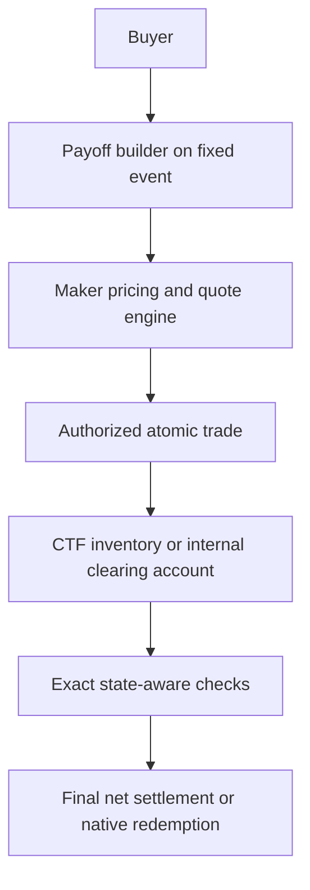

# Architecture, payoff representation and computation

## Recommendation

**Architecture A for the finite-state product prototype; Architecture B as a measured research alternative. Do not replace CTF for the stated MVP.** The ledger proof establishes a sound alternative representation. It does not establish a funding advantage over the native atomic-claim construction.

The existing repository's native CTF direction remains the implementation reference. This research narrows to one expiry, whereas that design also discusses multiple independent observations. Sharing an ongoing event label does not allow offsets between those observations.

## A versus B versus C

| Dimension | A: above native CTF | B: internal entitlements, optional CTF export | C: custom claims throughout |
|---|---|---|---|
| Backing for finite nonnegative curves | Exact worst-state floor via common atomic inventory | Same floor | Same floor |
| Issuance | Allocate existing claims or fund complete sets | Paired signed account changes | Own issuance and claim rules |
| Variable payoff | Basket of native tokens; optional wrapper | One vector/cover balance in account | Own token/ledger representation |
| Persistent maker portfolio | Wallet/vault inventory plus offchain normalized vector | Native cash, signed lots and cached vector | Must implement |
| Risk enforcement | Funded inventory plus correct delivery and complete-set operations | Every affected account checked after candidate batch | Entirely custom |
| Settlement | Native redemption | Direct net USDC claim; CTF optional | Own redemption |
| Transferability | Native ERC-1155 baskets | Internal novation or separately validated export | Own interfaces |
| Main added trust surface | Oracle adapter, execution, optional custody wrapper | Oracle, custody ledger, risk math, settlement, export | All of B plus replacement claim machinery |
| Best reason to choose | Small common domain and composable claims | Repeated account operations are materially cheaper or necessary | Proven incompatibility beyond an adapter's capabilities |

Native CTF is a settlement and backing mechanism, not a full pricing/exchange application. Architecture A still needs real maker quotes and safe execution. A balance checker can normalize wallet inventory to the common vector, but should execute native funded transformations rather than introduce a second independent reserve for the same claims.

For arbitrary curves, A's UI may show one cover while a buyer actually holds several CTF balances. A single transferable curve token would require a basket custody wrapper; it is not native CTF. Before adding it, establish whether a basket-aware wallet/UI suffices.

B can bind the same canonical condition and oracle while keeping obligations internally. CTF does not back those unminted obligations; Asce's vault does. At expiry, minting winning CTF claims merely to redeem them adds work and circular custody movements. Settle internal accounts directly in collateral. CTF export is an interoperability operation, not an essential final step.

## Internal vault to CTF: concrete safe routes

1. **Buy/export existing vault inventory:** verify held native claims, remove the buyer's internal right, transfer the exact basket, update the vault asset vector, and recheck its residual account.
2. **Fund a common condition:** spend real vault cash on complete sets, retain all residual atomic claims, and export only the buyer's basket. Cash becomes contingent owned inventory; it has not disappeared. Use the extended conservation equation in [the math](03-math.md).
3. **Internal claim transfer:** move rights and consideration inside the ledger and recheck both accounts. This preserves internal netting without a CTF conversion.
4. **Final cash settlement:** pay the resolved net entitlement once.

Never leave the internal long in place after exporting its native counterpart. Never count CTF's escrow as free assets of the vault unless the vault owns corresponding redeemable claims. Never issue a fake CTF ID from the internal ledger. CTF minting still consumes collateral or existing claim inventory.

If B has insufficient base cash because assets are already contingent CTF positions, an additional full split may be infeasible even when the terminal asset vector is sufficient. Use its owned inventory/conversions or decline that export. Solvency does not imply arbitrary asset liquidity before resolution.

## Minimal contract boundaries

### Architecture A

Use the existing CTF contract, one `EventOracleAdapter` and one bounded execution contract when trading is implemented. An offchain payoff builder/SDK creates descriptors and baskets. No separate cover factory, graph evaluator, position registry or margin vault is required for native subsets.

| Component | Responsibility and stored state | Dependencies and external calls | Core invariant |
|---|---|---|---|
| EventOracleAdapter | Immutable observation terms/domain, cutoff, failure rule, pending/final state, epoch | Pinned source verification, CTF prepare/report calls | A final result is an allowed unique state and cannot be rewritten |
| Bounded executor | Authorized basket inputs/outputs, cumulative fills and cancellation if selected | Pinned collateral and CTF transfers/splits/merges; adapter reads | Exact authorized assets conserved; every promised outgoing claim actually delivered |
| CTF | Existing token backing and redemption | Collateral token | Use the tested native rules; verify actual deployment before production |

The research recommends maker quotes as the first liquidity source. It does not finalize whether persistent onchain orders or signed offchain quotes are best; the repository intentionally leaves that choice open.

### Architecture B research alternative

Use **two contracts**: `EventOracleAdapter` and `ClearingHouse`. The latter owns USDC custody, portfolio balances, trade execution and lazy settlement. `RiskMath` is an internal pure library, not an independently trusted upgradeable risk oracle. The registry and state-space record live in the adapter; positions and cash live in the clearing house. A CTF adapter is unnecessary until export/import is actually required.

ClearingHouse stores event-scoped account cash, cached signed `p[k]`, per-cover lot balances when reusable positions are needed, revisions/nonces, fill totals, credited escrow and claimed state. Cover definitions bind a full integer vector and event terms. Trades cannot supply an unchecked vector unrelated to the authorized cover. The risk loop performs no external calls.

Trusted dependencies are the fixed event resolver/finality policy and supported token. Contracts must reject unrecognized tokens, mutable payoff code and unbounded user execution hooks. Administration may stop new trading but must not alter funded promises or seize settlement assets.

No generic `MarketRegistry`, `PositionManager`, `MarginVault`, `RiskEngine` and `SettlementModule` deployment stack is justified for one domain. Splitting code into libraries is different from adding trust boundaries.

## Representation comparison

| Representation | Storage/update work | Netting and settlement | Composition/pricing implications |
|---|---|---|---|
| Dense integer vector | `n` entries per definition and aggregate account; `O(n)` update/check | Direct and exact; settlement one selected entry | Atomic state basis; easiest independent verification |
| Constant-cap mask | One mask plus cap; update selected states | Exact subset payoff | Native CTF collection; compact interval covers |
| Interval list | `r` ranges; simple loop or range data structure | Normalize to atoms | Concentrates common range liquidity; overlapping ranges allowed |
| Threshold/digital differences | Often a few coefficients; arbitrary vector can need `n` | Same payout when arithmetic/exception terms match | Common basis reduces quote dimensions; signed coefficients must remain internal or funded |
| Piecewise-linear knots | `m` knots/slopes plus tail/rounding rules | Optimize over union of knots and exception branches | Exact ramps/option-like shapes; more implementation obligations |
| Strike decomposition | Option/digital coefficients | Equivalent bounded combination if all terms match | Useful external hedging/pricing basis; not a different collateral invariant |
| Splines | Coefficients, roots and certified bounds | Extrema may lie inside intervals | Unnecessary solver/precision risk for MVP |
| ERC-6909 balances per state | Multi-token storage/transfer interface | Does not define backing or solve signed debt | Possible interface after accounting is sound |
| Packed bounded coefficients | Fewer slots, checked wider intermediates | Exact if bounds are enforced | Later optimization; signed unpacking and overflow need verification |

ERC-6909 is a multi-token interface, not a risk or clearing algorithm. Choosing it over ERC-1155 does not produce margin relief. [Standard](https://eips.ethereum.org/EIPS/eip-6909)

**MVP choice:** integer vectors as canonical research semantics, native CTF atomic/subset balances for A's custody. For B, keep one aggregate signed vector per account and reusable immutable cover definitions. Start with full-width checked arithmetic; pack only after benchmarks and proving bounds. Avoid scanning all open positions on each trade: update `p[k] += Δq*f[k]` and scan `p` once.

For `H=[100,70,30,0,0]`, the atomic representation is `100e0+70e1+30e2`. A nonnegative subset decomposition is `30*1_{0,1,2}+40*1_{0,1}+30*1_{0}`. The threshold-difference representation is `100*1_normal−30*T1−40*T2−30*T3`, where `Tk` pays on normal states at/above index `k` and all terms pay zero on INVALID. A constant including INVALID would change the cover. The three representations agree on every declared state.

## State domain and scalar basis risk

Atomic states are the coarsest equivalence classes on which every admitted payoff and failure rule is constant. Before trading, sort allowed scalar boundaries, define every endpoint convention, add unbounded tails and exceptions, and lock the partition. Compatible new curves may be listed later only if they are constant on these existing atoms.

For one scalar terminal observation, an explicit graph adds no value beyond an ordered partition and state table. Graphs become useful for path-dependent covers, which are outside this MVP. Do not import `model_v2`'s history graph complexity merely because it is available.

An arbitrary new strike inside a bucket is unsupported, rather than silently rounded. New grids require a new clearing domain unless a future verified migration preserves all previous meanings; they receive no automatic offsets. Bound template grids and listing counts to avoid fragmentation. CTF's per-condition 256-slot limit includes exceptions; 6–11 states initially and a separately benchmarked ceiling of 32 are reasonable research limits.

Buckets are exact for aligned digitals and state-valued curves. They are not exact protection for a continuously varying external loss. For a Lipschitz payoff with constant `K` and finite bucket width `h`, midpoint approximation has error at most `Kh/2`; tail/error policies need separate bounds. Digital boundaries have no such small uniform error: a misplaced strike can change a full cap. Never use these price/payoff approximations to understate promised settlement liability.

Move to exact piecewise-linear domains if recurring buyer needs require ramps or precise unaligned strikes. The [mathematical conditions](03-math.md#9-continuous-scalar-extension) explain when knot extrema suffice and where integer rounding changes the problem.

## Gas and scaling

For 8–32 states, begin with incremental vectors plus an `O(n)` exact scan. A cached maximum is only safe after updating it correctly; changing the maximizing entry can require rescanning even if no new entry overtakes the old maximum.

Storage generally dominates a few dozen additions/comparisons. The table estimates storage work alone for **two dense accounts**, one full storage slot per state, changed once, no refunds or access lists:

| States | Existing nonzero entries updated | Zero entries initialized |
|---:|---:|---:|
| 8 | 80,000 gas | 353,600 gas |
| 32 | 320,000 | 1,414,400 |
| 256 | 2,560,000 | 11,315,200 |
| 1,024 | 10,240,000 | 45,260,800 |

These are derived operation estimates: approximately 5,000 per cold nonzero reset and 22,100 per cold zero initialization. They exclude definition storage, cash, signatures, fills, token calls, logs, calldata and arithmetic. Actual layouts, unchanged entries, packing and target-chain rules alter them. A sparse update plus a full scan additionally touches unchanged cold slots. They are **not measured custom-clearing transaction gas**. [EIP-2200](https://eips.ethereum.org/EIPS/eip-2200), [EIP-2929](https://eips.ethereum.org/EIPS/eip-2929), [refund rules](https://eips.ethereum.org/EIPS/eip-3529)

The new local CTF baseline measures a six-state full split at 323,334 gas and the three basket deliveries at 118,237, 118,237 and 133,232: 693,040 across those four standalone transactions. Half-C's basket buyback is 130,508; merging 500 of the six-state complete set is 200,657. These exclude deployment, preparation, ERC-20 premium/payments/approvals and production authentication. Combining calls may change costs. They provide a control, not proof B is cheaper. [Recorded measurements](../research/ctf/state-clearing-baseline-results.json)

| Technique | Appropriate use | Why not the first version |
|---|---|---|
| Cached vector + full scan | Arbitrary small dense curves | Recommended baseline |
| Sparse delta | Few changed states | Still validate the full worst case |
| Lazy segment tree | Large fixed domain, interval-add / max or min queries | More storage/invariants; arbitrary dense update still touches many nodes |
| Interval tree | Manage overlapping definitions | Does not alone maintain aggregate global extrema |
| Fenwick tree | Prefix sums / point values | Ordinary Fenwick sums do not supply dynamic global minimum after general updates |
| Offchain extrema + witness | Previews | One worst-state witness proves a lower bound, not that no worse state was omitted |
| Merkle vectors | Commitments and point proofs | A root/point proof alone proves no global solvency; needs verified transitions and aggregates |
| Solver certificate | Structured extension with tractable proof | General bounded programs can make exact maximization hard |
| ZK proof | Huge-domain exact transitions with audited circuits and available witnesses | Verification, custody updates and data availability add complexity; no bottleneck demonstrated here |

Use larger data structures only after onchain measurements show a real cost barrier for required curves. Neither an offchain quote engine nor an unverified risk proof may replace the invariant.

## Pricing and risk-capacity suppliers

Pricing may use distributions, hedges and inventory preferences. Clearing uses exact contractual amounts. A quote can cost 1,000 and create a 10,000 payout. Maker capacity `ΔR` can affect a quote but does not determine a unique fair premium.

Start with one funded professional maker supporting reusable covers, with direct quotes and optionally basket quotes. RFQ is an execution route, not a change to the product into individualized insurance. Later multiple maker accounts remain separately solvent; no automatic cross-owner offset is assumed.

| Supplier | Strength | Main limitation |
|---|---|---|
| Professional maker account | Inventory-aware cover pricing and concentration of related obligations | Source/quote/adverse-selection risk; demand unproven |
| RFQ underwriter | Firm bounded packages and bespoke size | Availability and competition |
| Passive pool | One pool portfolio can share deterministic capacity | Pricing policy, adverse selection and LP redemption/NAV become additional problems |
| Protocol-owned liquidity | Controlled pilot liquidity | Treasury bears losses; subsidy is not demand |
| Hybrid | Makers quote against explicitly delegated pool capital | Must specify who owns liabilities and who bears losses |

Anonymous LP deposits do not prevent netting if they own shares of one funded portfolio. They also do not automatically produce fair two-sided prices. Pending LP withdrawals cannot consume locked backing; price-based redemption against contingent NAV needs funded counterparties or an explicit mechanism. Do not promise instant par withdrawal of risk capital.
