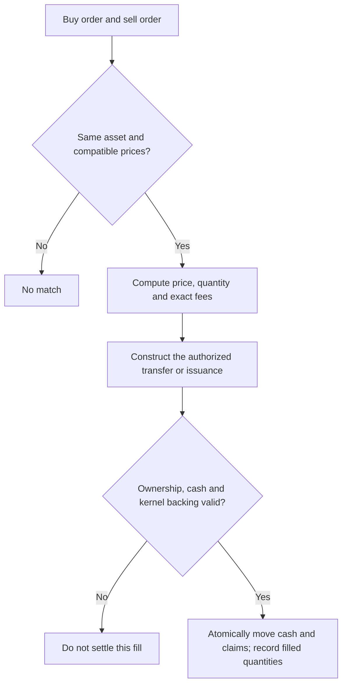

# How AsceMarket orders match, accounts balance and netting works

> Earlier custom-kernel order design. The [main CTF architecture](contracts/ctf-cover-architecture.md) defines the chosen settlement foundation; the exchange is deferred. Do not import this earlier kernel order model as an agreed CTF exchange design.

Reviewed **29 September 2026** against [the kernel specification](v2-kernel-spec.md), [ledger.py](model_v2/ledger.py), [verifier.py](model_v2/verifier.py), and [the core contract design](v2-core-contract-design.md).

This is a plain-language design review with worked arithmetic. It describes the exchange-to-kernel boundary, not a finalized order-book implementation. Proposed matching choices and unimplemented extensions are labeled. Section 2 defines the Asce order profile, ownership and price limits. Outstanding product choices are listed in section 12.

For the contract-by-contract flow, entry points and lifecycle state tables, read [the complete order lifecycle](v2-contract-order-lifecycle.md). Its restricted settlement gateway is the proposed integration for the order rules here.

## 1. The three things we must keep separate

| Thing | Simple meaning |
|---|---|
| Cover definition / CoverID | What ONE unit pays, and under what rules |
| Order | How many units someone is willing to buy/sell, at what price |
| Issued claim supply | How many transferable units currently exist |

**Supply is variable, not a fixed issuance allocation.** A funded fill can create more units under the same CoverID. Reselling existing tokens does not create supply. Importing or redeeming tokens reduces external supply.

A buy order for 100,000 units is acceptable in principle if counterparties can execute it and all configured limits are met. The kernel updates integer quantities; it does not create 100,000 cover definitions or loop once per unit. Matching against many different orders is additional work and must be bounded.

We still need measured arithmetic and exposure limits. Those limits protect execution and backing; they are not a token-sale allocation or a predetermined supply schedule.

## 2. Order terms and ownership

### Fixed asset context

The Asce integration is bound to one AsceManager deployment. That manager implements the ERC-6909 cover tokens and the kernel; the current architecture does not use a separate CTF contract.

Orders specify `coverId`. The token interface uses `uint256(coverId)` as its token ID. CoverID commits to the event and complete cover terms, so EventID, tokenId and an outcome-side field are not repeated in the order.

```text
Asce integration's fixed manager + order.coverId
                      ↓
Manager's validated cover definition → EventID
                      ↓
Event's immutable collateral asset + current epoch
                      ↓
Check trading eligibility and settle against that asset
```

A hash cannot be decoded to recover its definition. Terms must already be admitted, or supplied through the authorized first-use path. Unknown IDs cannot execute until validated.

The claim contract comes from the integration's fixed configuration. The collateral token comes from the event's immutable terms in the manager. Neither is a caller-selected order field. The exchange and kernel must use the same resolved asset, and must reject a mismatch with any book configuration. An existing order must never be silently reinterpreted under a different manager or collateral asset.

This is an **Asce-specific order profile**. A generic exchange still distinguishes assets by their contract, standard and token ID through its book configuration. It must not treat equal cover IDs in different managers as the same asset. ERC-6909 IDs are scoped to their token contract. [ERC-6909 standard](https://eips.ethereum.org/EIPS/eip-6909).

### Maker, receiver and caller

These are three separate roles:

| Role | Meaning | Authority |
|---|---|---|
| `maker` | Owner of the order and source of its authorized funds or claims | Authorizes the trade; owns any writer obligation |
| `receiver` | Destination chosen by the maker for purchased claims or owned-sale proceeds | Receiving assets grants no authority over the maker's account |
| `msg.sender` | Caller of the current contract function | May submit or trigger execution; calling alone grants no authority to spend another user's assets |

The order includes an explicit, nonzero receiver. Wallets normally set it to the maker, but BUY and SELL_OWNED orders can name a different destination. This supports purchases for another wallet or a compatible contract without changing who pays.

A third-party matcher makes it necessary to authenticate the maker independently of the fill caller. It does not by itself require a separate receiver: a protocol could always pay the maker. Asce keeps receiver as an intentional output-routing capability. It never substitutes for maker authentication.

| Order | Funding source | Destination |
|---|---|---|
| BUY | Maker's authorized collateral balance | Purchased external cover tokens go to receiver |
| SELL with OWNED | Maker's existing cover tokens | Sale proceeds after fees go to receiver |
| SELL with WRITE | Maker's deposited event margin plus this fill's premium | Premium after fees credits maker's internal event account; new claims go to the BUY order's receiver |

For WRITE, require `receiver == maker` in the initial profile. The premium credits that maker's margin account, not their wallet. This is a deliberate restriction of the initial writing path; supporting a different proceeds destination would require funding the obligation without counting the diverted premium. The maker may separately withdraw what the kernel proves is free. Writer debt never moves to the buyer or its receiver.

Receiver is immutable for an accepted order. The matcher cannot replace it. There is no delivery-mode field: purchases deliver external cover tokens; import into margin is a separate authorized core action.

```text
Alice's BUY order: maker = Alice, receiver = Alice's vault
Bob's owned SELL order: maker = Bob, receiver = Bob
Matcher M triggers execution:
    Alice's authorized balance pays
    Bob supplies the cover tokens
    Alice's vault receives those tokens
    Bob receives the sale proceeds
    M receives neither asset merely because M called the function
```

A receiving contract must support using the received asset; selecting it does not give it automatic withdrawal or redemption integration. The maker chooses this destination.

CoW's order data likewise binds a receiver independently of the order owner. Asce uses an explicit nonzero address instead of CoW's zero-address shorthand for the owner. [CoW order library](https://github.com/cowprotocol/contracts/blob/main/src/contracts/libraries/GPv2Order.sol).

### Placement input and stored order

The first version keeps orders, cancellation and fill accounting onchain. Direct posting authenticates the maker through the posting transaction. Matching callers may be users or an automated service; no exclusive centralized matcher is required.

The following is the target Asce order interface for direct posting. It is a design specification, not deployed Solidity.

```solidity
enum Side { BUY, SELL }
enum SellMode { OWNED, WRITE }

struct OrderParams {
    address receiver;
    bytes32 coverId;
    uint256 makerAmount;
    uint256 takerAmount;
    uint256 expiration;
    uint256 epoch;
    uint16 maxFeeRateBps;
    Side side;
    SellMode sellMode;
}

struct Order {
    address maker;
    OrderParams terms;
}

// Authenticates the owner by recording maker = msg.sender.
// Validates the receiver and terms; assigns a unique onchain ID.
function placeOrder(OrderParams calldata params)
    external returns (uint256 orderId);

// Cancels the remaining quantity; requires stored maker == msg.sender.
function cancelOrder(uint256 orderId) external;
```

The maker is recorded at **placement**, never replaced with the caller at **fill**. The maker can be a smart-account contract calling directly. A service calling `placeOrder` without user authorization creates its own order, not an order owned by the user it claims to represent.

BUY uses canonical `sellMode = OWNED`; sell mode has economic meaning only for SELL. OWNED never silently creates debt. WRITE issues new funded units and does not automatically blend them with existing tokens.

Placement assigns a unique order ID and arrival sequence. Filled claim lots, cancellation, effective fee rate and cumulative fee accounting are separate execution state. No user salt or signature is needed for direct posting. Token approvals are still required where tokens are pulled; an approval alone does not authorize a price, receiver or writer obligation.

### Relaying and settlement authorization

A matcher executing an already-posted order needs no fresh maker signature for each fill: the onchain order is the standing authorization, subject to its limits and current backing.

Submitting an order **on behalf of a maker** is a different operation. A relayed-posting extension must carry explicit maker identity and a maker-authorized payload binding every term, including receiver. It must use EIP-712 domain separation with chain ID and verifying contract, validate the maker's EOA or ERC-1271 wallet authorization, and consume a maker nonce on successful registration. Subsequent partial fills reference that single stored order; replaying the registration cannot create another allowance to fill. EIP-712 itself does not provide replay protection. [EIP-712](https://eips.ethereum.org/EIPS/eip-712).

Relayed posting is not required merely to allow third parties to execute the onchain book. The direct-posting interface above remains the initial scope; unsigned maker addresses from a centralized service are never trusted.

When the exchange calls AsceManager, the manager sees the exchange as `msg.sender`, not the maker. The integration must validate bounded order authority for the actual owners and authorized receivers. Neither `msg.sender` at settlement nor `tx.origin` is a substitute for that authority. The [lifecycle guide](v2-contract-order-lifecycle.md#6-the-exchange-to-manager-authorization-boundary) proposes a restricted pinned-exchange gateway for this purpose. Its contract-level authorization checks remain an implementation prerequisite, not a tested feature.

The standing WRITE path authorizes use of deposited event margin and this fill's premium, less fees. It does not authorize an automatic wallet collateral pull. Explicitly funded core packages remain a separate capability.

### Amounts, quantity and price

`makerAmount` and `takerAmount` encode total claim quantity and its price limit. No separate quantity or limit-price field is stored.

For our proposed claim-quantity-limited orders:

| Side | makerAmount | takerAmount | Derived limit price |
|---|---|---|---|
| BUY | Maximum trade payment for the full requested quantity, excluding fees | Total claim lots requested | makerAmount / takerAmount |
| SELL | Total claim lots offered | Minimum trade proceeds for the full offered quantity, before fees | takerAmount / makerAmount |

BUY fills stop at the requested claim quantity. A better price leaves some payment unused; it does **not** authorize purchasing extra claims. SELL fills stop at the offered claim quantity. This quantity convention is our explicit design choice, not a claim that every exchange using these field names behaves identically.

```text
Alice: BUY 10 lots at no more than 32 USDC each
makerAmount = 320 USDC
takerAmount = 10 claim lots

Bob: SELL 6 lots at no less than 30 USDC each
makerAmount = 6 claim lots
takerAmount = 180 USDC

Bob's resting ask fills against Alice:
6 lots move to Alice's authorized receiver
180 USDC trade payment is settled
Alice has 4 lots remaining at the same 32-USDC limit
```

The example uses readable USDC amounts. In calldata, collateral amounts use the asset's base units; claim amounts use the admitted cover's integer lots. For a six-decimal asset, 320 USDC is `320_000_000`. Never compare human-readable decimal strings onchain.

For the first version, accept ratios that encode an exact integer collateral-base-unit price per claim lot. Require positive amounts and exact divisibility of the collateral amount by claim lots. Reject unsupported fractional prices rather than silently rounding. This preserves the existing integer-per-lot proposal without storing a duplicate price field. Tick-size refinements can come later.

Polymarket's published CTF exchange order struct also contains `tokenId`, `makerAmount`, `takerAmount`, side, expiration and cancellation/fee fields. That supports the representation; we are specifying our own fill and funding semantics here. [Published order struct](https://github.com/Polymarket/ctf-exchange/blob/main/src/exchange/libraries/OrderStructs.sol).

### Price protection and fees

The amount ratio sets the worst permitted execution price. A separate slippage-percent field is unnecessary for a resting limit order.

For a fill of `q` claim lots with trade payment `c`, before fees:

```text
BUY:  c × takerAmount <= q × makerAmount
SELL: c × makerAmount >= q × takerAmount
```

Use checked arithmetic with validated bounds, or a full-precision comparison implementation. An overflowing multiplication must never bypass a price check.

Alice's 32-USDC limit permits execution at 30 or 31, but never 33. For an immediate purchase, the UI can convert a chosen slippage tolerance into a worst acceptable limit and submit a price-capped immediate-or-cancel instruction. It cancels any unfilled remainder; there is no unlimited-price market order.

Fees need their own protection: authorize `maxFeeRateBps`, define the fee base as actual executed trade payment, and pin the effective rate when accepting the order. Require the cap and effective rate to be between 0 and 10,000 basis points, and reject an effective rate above the cap. BUY's payment limit excludes separately authorized fees; SELL's minimum proceeds are before separately authorized fees. Show the maximum debit or minimum net proceeds in the UI. Cumulative fee rounding must not make repeated partial fills exceed the authorized cumulative fee.

## 3. When two orders match

For the same `coverId` under the fixed AsceManager and its derived collateral asset, derive each limit from its amount ratio:

```text
Buy limit price >= sell limit price
```

Both orders must also be active, authorized, unexpired, within their remaining quantities and compatible with the authorized receiver and funding rules. The cover must still be eligible for protocol trading.

**Proposed initial priority:** best price first, then chain-recorded arrival order at that price. Execute at the resting order's price. These exchange choices are recommendations, not already implemented in the kernel.

Example:

```text
Bob already has an ask on the book:
    SELL 6 units of A at 30 each

Alice submits:
    BUY 10 units of A at up to 32 each

Prices cross: 32 >= 30
Fill quantity: min(10, 6) = 6
Execution price: 30 (Bob's resting price)
Premium: 6 × 30 = 180 USDC

Bob's remaining order:   0
Alice's remaining order: 4
```

If another eligible seller offers the remaining 4 at 31, the next fill costs 124. Alice then pays 304 total, before fees. She never pays more than her limit for a unit. Whether an unmatched remainder rests or cancels is explicit in the authorized instruction: normal placement may rest; the immediate-or-cancel entry point cancels the remainder. A matcher cannot choose this afterward.

No privileged market maker must approve the match. Any ordinary seller can be the counterparty. A market maker is a user who maintains quotes. A transaction executes matching; contracts do not wake up and trade without a transaction.

## 4. Two separate checks: price compatibility and financial validity



Matching prices does not prove the seller has tokens or backing. Posting a large offer does not create collateral. The system must check both.

## 5. Case A: the seller already owns the claim tokens

Use the 6-unit fill at 30 above. Bob owns 6 external tokens of A. Alice pays 180 USDC.

| Change | Alice | Bob |
|---|---:|---:|
| Payment | −180 | +180 |
| External A tokens | +6 | −6 |

Outstanding A supply does not change. The original writer's obligation does not change. The collateral backing these units remains in AsceManager.

The separate exchange must transfer payment and claims atomically. If it uses deposited balances, it updates that custody accounting; if it uses authorized wallet transfers, it must verify the actual transfers. That custody choice is not fixed by this example.

**No new kernel margin calculation is required just to move already-exported tokens.** An internal-margin sale is different: removing an internal positive holding could remove a hedge, so the whole resulting account must be checked.

Only the current token owner can redeem those units later. The original seller cannot redeem tokens they no longer own.

## 6. Case B: the seller writes new units during the fill

Now Bob does not own A tokens. He explicitly offers to write them. Assume A pays between 0 and 100 per unit across ALL normal and exceptional histories, and there are no other positions or fees.

```text
Quantity:                 6
Price per unit:           30
Maximum payout per unit: 100
Buyer premium:          180
Maximum obligation:     600
Writer contribution:    420
```

An explicitly authorized core package can combine deposits and issuance in one transaction. The proposed standing WRITE order instead requires Bob to have the needed 420 already deposited; it does not automatically pull 420 from his wallet. The following table illustrates the combined core package:

| State | Before | After |
|---|---:|---:|
| Bob's wallet USDC | Starting balance | Decreases by 420 |
| Alice's wallet USDC | Starting balance | Decreases by 180 |
| Bob's internal cash | 0 | 600 |
| Bob's internal A quantity | 0 | −6 |
| Alice's external A tokens | 0 | 6 |
| External supply/reserve for A | 0 | 6 |
| Event escrow | 0 | 600 |

The buyer's premium becomes part of the writer account's backing. Cash 600 does not mean Bob can withdraw 600 while owing the cover.

The verifier checks:

```text
If each unit pays 100: Bob's entitlement = 600 − 6 × 100 = 0
If each unit pays   0: Bob's entitlement = 600 − 6 ×   0 = 600
```

The buyer has a reserved right to `6 × payout`. Adding buyer rights and Bob's entitlement always gives 600. The buyer has no duplicate internal +6 position when delivery is external tokens.

At a payout of 100, Alice redeems 600 and Bob receives zero. At a payout of zero, Alice receives zero and Bob can withdraw 600, including his original 420. Intermediate scalar payouts work with the same accounting.

**The generic exchange cannot mint arbitrary claims.** It requests the authorized issuance; AsceManager performs funding/conservation checks and creates the units. Any failure reverts payment, issuance and fill-counter changes together.

## 7. The actual netting math

For each owner within one event:

```text
Entitlement on a possible history
    = internal cash + sum(signed quantity × cover payout)

Account is funded if its lowest possible entitlement is at least zero.
```

Positive quantities are owned rights. Negative quantities are obligations. The graph supplies the permitted joint histories. It includes cancellation, source failure and all other contractual exceptions.

### Example 1: two covers can both win

Bob writes one A for 30 and one B for 40. Each pays at most 100.

| Possible result | A payout | B payout | Bob owes |
|---|---:|---:|---:|
| Neither wins | 0 | 0 | 0 |
| Only A wins | 100 | 0 | 100 |
| Only B wins | 0 | 100 | 100 |
| Both win | 100 | 100 | 200 |

Combined premium is 70. Worst liability is 200. With no other positions, Bob contributes **130**. His resulting internal cash is 200 with quantities A = −1 and B = −1.

Putting both covers inside the same event does not automatically reduce backing.

### Example 2: the graph proves only one can win

Suppose the admitted rules allow A-only, B-only and neither, but never both, including exceptional histories.

| Possible result | Bob owes | Entitlement with cash 100 |
|---|---:|---:|
| Neither | 0 | 100 |
| A only | 100 | 0 |
| B only | 100 | 0 |

Bob still receives 70 premium. Worst liability is now 100. His additional contribution can be **30**.

This is netting: funding the worst COMBINED obligation instead of separately adding each cover's maximum. The kernel proves it from the definitions and event graph, not their names or apparent correlation.

### Example 3: cancellation changes the answer

Keep normal A/B exclusivity, but suppose a cancellation branch pays 60 on each cover.

```text
Normal worst liability:       100
Cancellation liability:       120
True worst liability:         120
Premium received:              70
Writer contribution required:  50
```

Ignoring cancellation would underfund the account by 20.

### For an account that already has positions

Do not reuse `maximum payout minus premium` as a universal formula. That shortcut above assumes an initially empty writer.

The actual engine first builds the complete proposed account, including old holdings and premiums/fees, then computes:

```text
additionalDeposit = max(0, −minimumCandidateEntitlement)
```

The amount is a preview, not permission to pull money. External funding must fit the owner's explicit authorization. The current model's resting maker order does not itself authorize a new wallet deposit on fill; a maker needs sufficient deposited account backing, or a later explicitly designed funding authorization.

## 8. Why a basket can need atomic execution

In the exclusive A/B example, Bob contributes 30 and expects 70 combined premiums.

If A executes alone first:

```text
Cash:       30 + 30 = 60
A liability:          100
Shortfall:             40
```

That transaction must fail. B arriving later cannot repair an already-underfunded accepted trade.

If both execute in ONE authorized package:

```text
Cash:                 30 + 30 + 40 = 100
Worst combined liability:           100
Shortfall:                             0
```

The package can succeed. Alternatively Bob could fund the first standalone fill with 70, then later release the extra guaranteed floor after B fills.

**Separate resting orders do not automatically promise a combined atomic fill.** The initial exchange may support only independently valid fills. A basket/all-or-nothing route needs explicit authorization and matching semantics. The kernel already supports checking an exact multi-cover package, which is a separate capability from finding its counterparties.

## 9. Fees, partial fills and quantities

Fees are real cash movements to explicit recipients. They cannot disappear from the conservation equation.

For the one-unit A example (payout cap 100, premium 30), suppose the seller pays a fee of 1 and the buyer pays a fee of 2:

```text
Buyer contributes:                32
Writer contributes:               71
Fee account receives:              3
Writer cash after premium/fee:    100
Outstanding cover maximum:       100
Total escrow, before fee withdrawal: 103
```

The fee account's 3 is an entitlement separate from the cover reserve. Whether fees apply and their sizes are product parameters, not assumed by the zero-fee examples.

Use integer lots and exact asset base units. For the first pricing design, use an integer per-lot price and fee rule. Define the minimum fill and final remainder behavior. Cumulative fills must never exceed authorized quantity, and splitting one order into many fills must not create value through rounding.

A 100,000-unit order can be filled by one counterparty or many. The exchange records remaining quantity after each committed fill. A bounded transaction may need to leave some quantity for a later transaction. Gas depends on touched orders/accounts/definitions and graph complexity, not a loop over all individual units.

## 10. The authorization gap we must close before connecting an exchange

The mathematical spec already distinguishes:

- **Exact package:** every participant authorizes the whole assembled operation.
- **Standing order:** a maker authorizes bounded future fills, not every future batch.

`model_v2` implements a harness standing-order path (`post_order`, `fill`, cancellation and cumulative quantities). It checks the current complete maker account at fill time. These are Python actor/approval assertions, not production signatures.

The newer core-contract guide deliberately deferred exchange authorization and currently describes exact packages. That is sufficient for direct package execution, but **not sufficient to claim automatic resting-order integration is already designed**.

The lifecycle guide proposes a narrow settlement gateway: the immutable exchange authenticates and bounds the order, while the manager checks permitted settlement actions, custody and backing. This explicitly trusts the exchange code for order authorization. Before implementation, bind each generated maker change to its owner-authorized onchain intent or signed order: permitted CoverID, sell mode, claim-quantity cap, amount-ratio price/fee bounds, maker identity and authorized receiver, epoch, deadline and remaining fill capacity. The matcher cannot append unrelated debt or withdrawals. Contract-level validation and fill counters must be atomic with the trade. Do not grant the exchange unrestricted spending merely because it is our own contract.

An order authorizes a constrained fill even when the maker's account revision changes. The fresh account must still pass backing checks. Exact packages normally bind revisions; confusing these two authorization modes would cause resting orders to needlessly expire after every account action.

## 11. Other design concerns from this review

| Concern | Simple explanation | Current position |
|---|---|---|
| Stale orders after facts | A quote before a goal can be wrong afterward | Existing default is exact event-epoch binding; stale orders stop filling and require refresh |
| Ineligible orders at the best price | An unfunded order must not permanently block everyone behind it | Need bounded skipping/pruning rules; never catch arbitrary settlement failures and silently continue |
| Admission policy | “Anyone may define terms” differs from “every definition is accepted” | Current model requires admin admission; automatic checked templates are not implemented |
| Funds reserved twice | Two offers might rely on the same free backing | Current unreserved model rechecks each actual fill; firm reservations need joint accounting |
| Model versus token implementation | Python validates signed accounts, not deployed token custody | Add export/reserve/import/redemption and actual signature/token interaction tests |
| Per-event catalogue work | Current final-fact application scans admitted covers | Bound distinct definitions; a huge quantity of one cover is a different issue |
| Contract guide consistency | Prepared/open/closed records looked like mandatory user steps | IDs can be computed locally; opening checks and first-use preparation can be internal to execution |
| Chain portability | We know Monad but not the second chain | Do not assume identical runtime, assets or oracle availability |

A provisional source report must not shrink funding support. Final facts may narrow support, never widen it after payouts become available. The matching engine uses current eligibility; trading does not itself decide the event outcome.

No new reason was found to add a fixed cover supply, a protocol-USDC wrapper, or a deployment per cover.

## 12. Outstanding product decisions

### Writing-order collateral reservation

**Choice 1 — recheck on fill:** posting does not reserve backing. This follows the current model. The order can become unfillable if its owner uses backing elsewhere. It can only execute when the kernel proves it is funded.

**Choice 2 — reserve when posted:** posting locks sufficient capacity, and other actions must respect all outstanding reservations. We must account for partial fills, cancellations and every executable combination; individually reserving supposedly netted orders is not enough.

Recommendation for the first version: choice 1, clearly presented as conditional executable liquidity. This remains a proposed policy, not a finalized reservation decision or a guarantee that posted orders can fill. Owned-token/buyer-cash reservation can have its own policy; do not silently assume it solves writer margin reservation.

### Second deployment chain

We need the actual chain name before choosing portable deployment assumptions. The events, balances and books are independent per chain unless we separately design bridging, which is currently out of scope.

Fee rates, finalization timeouts, source authority and numeric limits also need concrete deployment configuration, but they do not prevent understanding or testing the examples here.

## 13. What is already tested and what remains proposed

The reference covers signed cash/holdings, exact combined minima, conservative arithmetic limits, zero-sum batches, fees, partial standing-order fills, corrections/finality and lazy internal materialization. The current suite has 54 tests.

It does not implement the fully onchain order-book data structure, automatic best-price/FIFO matching, firm collateral reservations, real signatures, ERC-6909 custody or shared multi-event deployment. Passing those 54 tests cannot establish those features.

For the proposed integration, test owned sales and funded issuance separately, check partial fills/cancellation/races, compare separate versus atomic basket execution, reject stale epochs, and reconcile every account plus external reserve against escrow for every small-space history. Price discovery remains independent of payout/backing evaluation.

## 14. Lessons from Polymarket, CoW Swap and Pendle

Additional primary-source review: 29 September 2026. These are selected lessons, not a proposal to combine three exchange architectures. Source review is not deployed-bytecode verification.

| Source | Relevant mechanism | What we use |
|---|---|---|
| [Polymarket order lifecycle](https://docs.polymarket.com/concepts/order-lifecycle) | Limit prices, quantities, partial execution, cancellation and atomic settlement; matching is offchain | Familiar order semantics; our chosen onchain enforcement remains a separate implementation |
| [CoW order struct](https://github.com/cowprotocol/contracts/blob/main/src/contracts/libraries/GPv2Order.sol) | Explicit assets, amounts, receiver, validTo and partial-fill permission | Every value destination and execution limit must be authorized |
| [CoW settlement](https://github.com/cowprotocol/contracts/blob/main/src/contracts/GPv2Settlement.sol) | Tracks filled amounts, validates expiry and allows owner invalidation | Enforce these checks onchain, not only in the UI |
| [Pendle limit-order guide](https://docs.pendle.finance/pendle-v2/AppGuide/LimitOrder) | Order size, expiry and ongoing balance availability | A submitted order is not a guarantee that its owner still has spending capacity |
| [Pendle limit router](https://github.com/pendle-finance/pendle-core-v2-public/blob/main/contracts/limit/PendleLimitRouter.sol) and [base](https://github.com/pendle-finance/pendle-core-v2-public/blob/main/contracts/limit/LimitRouterBase.sol) | Order expiry before the underlying instrument's maturity, nonce-based invalidation and remaining amounts | Bind cover trading eligibility as well as the order's own expiry |

Pendle here means the v2 limit-order router, not its separate Boros product. CoW's solver/batch-auction machinery, Pendle's implied-yield pricing and AMM routing, and Polymarket's operator-based matching are not requirements for AsceMarket.

### We do have issuance and closing; we do not need CTF's matching categories

```text
One price/quantity matching flow
               ↓
       Select authorized delivery
        ├── Existing claims: transfer them
        └── New units: kernel checks backing, records debt and mints claims
```

Minting still happens in the second case. Calling the whole operation a fill does not remove it.

CTF-style complementary YES/NO buy matching and complete-set merging are not required by our signed-account architecture. Cover A and cover B must not be merged for a fixed payment merely because someone calls them opposite sides.

Our close operation is different: a writer with internal A quantity −1 buys/imports one unit of A, bringing the quantity to zero. The kernel then calculates what cash is withdrawable. Fees, repurchase price and other positions can change that amount; this is not a universal “two tokens become one dollar” rule.

## 15. Minimal normal-order rules for the first exchange design

These rules specify behavior to preserve when the exchange is designed. The collateral-reservation policy remains an outstanding decision in section 12.

| Rule | Simple implementation direction |
|---|---|
| Order identity | Assign a unique onchain sequence/ID; keep chain and contract domains distinct |
| Price and size | Positive maker/taker amounts encode claim lots and an exact permitted per-lot limit; quantity never means total cover supply |
| Expiry | Required `expiration`; no fill when `block.timestamp >= expiration` |
| Instrument deadline | No fill at/after the cover/event trading cutoff, even if the order expiry is later |
| Arrival priority | Record contract-assigned sequence; user-entered timestamps never establish FIFO priority |
| Partial fill | Fill only an authorized remaining quantity; increment filled quantity exactly once |
| Minimum size | Start with one executable lot and bounded order sizes; defer complex minimum-fill/remainder exceptions |
| Cancellation | Owner cancels remaining units onchain; already completed fills remain valid |
| Repricing | Cancel-and-replace atomically, with fresh priority; no silent mutation of signed/posted terms |
| Price protection | Buy execution price cannot exceed its limit; sell price cannot fall below its limit |
| Fees | Explicit bounded fee rule; debit payer and credit recipient; do not hide fees in collateral calculations |
| Event update | Bind Asce orders to the current event epoch; an old order needs refresh after invalidation |
| Permissions | Owner posting a transaction can authorize that onchain order; signatures are needed for relayed instructions, not for every direct call |
| Fill authority | A third party may trigger a permitted fill; it cannot change receivers, append debts or broaden owner authority |
| Atomic settlement | Cash, tokens, obligations and fill counters all succeed together or all revert |
| Owned-only sell | Insufficient owned units causes failure; never silently create debt |
| Writing sell | Fresh complete-account kernel check; no use of expected future fills as collateral |
| Self-match | Reject the same owner's orders matching for the initial Asce integration; do not claim this prevents related-wallet wash trading |
| Bounded execution | Limit visited orders, fills and account-verification work per transaction |
| Ordinary partial limit order | Supported first; a remainder may remain live until filled, cancelled or expired |
| Immediate execution | Use a price-capped immediate-or-cancel instruction; never an unlimited-price “market buy” |

An expiry timestamp and placement timestamp have different jobs. Expiry is an execution condition checked on every attempted fill. A timestamp alone does not trigger a transaction that cleans up the book. Removal can happen lazily during bounded matching or through permissionless cleanup of provably expired records.

The earlier resting-price/FIFO proposal remains the intended behavior for automatic book matching. Do not claim strict price-time priority if the initial API merely permits a caller to choose arbitrary order pairs. The onchain traversal must enforce it for that claim to be true. Chain ordering determines arrival, not when a user clicked the frontend button; no blanket MEV-protection claim is made.

### State we actually need for an order

```text
Immutable terms:
    maker (authenticated at placement), receiver, coverId,
    makerAmount, takerAmount, side, sell mode, expiration,
    maximum fee rate and event epoch

Bound asset context:
    fixed AsceManager; collateral derived from immutable event terms

Fixed at acceptance:
    effective fee rate; BUY/OWNED outputs go to authorized receiver;
    WRITE requires receiver == maker and credits maker event margin

Derived from amounts:
    total claim lots and limit price

Mutable execution state:
    filled claim lots, executed trade payment / fee accounting,
    cancelled flag, arrival sequence

Derived status:
    expired if now >= expiration
    filled if filled lots == total lots
    stale if event epoch no longer matches
    otherwise open or partially filled, subject to current backing
```

The onchain order's ID is not the CoverID. Many independently cancellable orders can trade the same CoverID. An expired order does not delete the owner's tokens or obligations.

For a generic exchange, event epoch and issuance checks belong to the Asce-specific settlement policy. An ordinary unrelated token pair should not need an EventID or a graph. The asset identity must include its token standard, contract and token ID where applicable; no wrappers are introduced by this rule.

### Failure behavior must stay honest

Expired/cancelled/stale records can be rejected or pruned with bounded work. An unexpected verifier/token/custody error reverts the attempted settlement; do not hide it behind a catch-all “skip maker” path.

Unreserved writing orders create a real matching complication: failure to fund a requested large fill does not prove a smaller fill is impossible. Do not automatically delete a whole order or bypass its priority on that evidence. The initial integration can reject that requested fill and allow a fresh smaller attempt, but automatic best-price traversal still needs a specified capacity/skip policy. That remains part of exchange design after the reservation choice, not a solved concern merely because funding checks exist.

Cancellation and filling compete in chain order. If a fill executes first, cancellation affects only the remainder. A successful preview cannot prevent a competing fill or an oracle update from changing state before execution.

No collateral pull beyond the authorized budget, no newly discovered fee after authorization, no silent rounding of lots, and no unlimited search for liquidity.

## 16. Small initial scope and acceptance evidence

Build only the necessary behaviors first: finite-expiry partial limit orders, owner cancellation, explicit prices/fees, atomic owned-token settlement and a separately authorized kernel issuance path. Immediate-or-cancel can serve immediate execution. Defer FOK, post-only, iceberg orders, stop orders, solver auctions, AMM routing, cross-event margin and automatic basket discovery until needed. Exact kernel packages can remain available without those exchange features.

Minimal tests for the order layer: coverId lookup and manager/book/collateral consistency; maker authenticated at posting; fill caller different from either maker; receiver different from maker; zero receiver rejected; WRITE receiver restriction and premium credited to maker margin; BUY quantity cap despite price improvement; amount-ratio price bounds and overflow; rejection of unsupported fractional lot prices; cumulative fee rounding; before/at/after expiry; partial fill followed by cancel; overfill; two competing takers; repricing/priority; attempted output redirection; fee bounds; integer rounding; stale event epoch; exhausted tokens/allowance; underfunded writing; failed collateral transfer; finality arriving before fill; and failed settlement leaving counters unchanged. Any relayed-posting extension additionally requires forged-maker, receiver-tampering, wrong-domain, nonce-replay and contract-wallet authorization tests.

Reference-model tests cover only part of this list. The fully onchain exchange and real token interactions need their own implementation tests. The aim is a small system with explicit rules, not importing every feature of another protocol.
